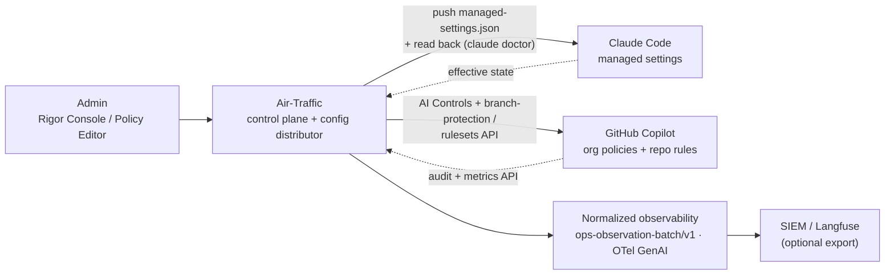

<div class="cover">
<div class="glow"></div><div class="glow2"></div>
<div class="eyebrow">AIR-TRAFFIC · AI CONTROL PLANE</div>
<div class="tile"></div>
<h1>Centralizing <span class="acc">Claude Code</span> &amp;<br/><span class="acc">GitHub Copilot</span> governance</h1>
<div class="sub">One control plane for the two agentic developer platforms your engineers actually use — set policy once, prove it continuously, never touch the inference path.</div>
<div class="chips">
<span class="vchip claude"><svg viewBox="0 0 24 24" fill="currentColor"><path d="m4.7144 15.9555 4.7174-2.6471.079-.2307-.079-.1275h-.2307l-.7893-.0486-2.6956-.0729-2.3375-.0971-2.2646-.1214-.5707-.1215-.5343-.7042.0546-.3522.4797-.3218.686.0608 1.5179.1032 2.2767.1578 1.6514.0972 2.4468.255h.3886l.0546-.1579-.1336-.0971-.1032-.0972L6.973 9.8356l-2.55-1.6879-1.3356-.9714-.7225-.4918-.3643-.4614-.1578-1.0078.6557-.7225.8803.0607.2246.0607.8925.686 1.9064 1.4754 2.4893 1.8336.3643.3035.1457-.1032.0182-.0728-.164-.2733-1.3539-2.4467-1.445-2.4893-.6435-1.032-.17-.6194c-.0607-.255-.1032-.4674-.1032-.7285L6.287.1335 6.6997 0l.9957.1336.419.3642.6192 1.4147 1.0018 2.2282 1.5543 3.0296.4553.8985.2429.8318.091.255h.1579v-.1457l.1275-1.706.2368-2.0947.2307-2.6957.0789-.7589.3764-.9107.7468-.4918.5828.2793.4797.686-.0668.4433-.2853 1.8517-.5586 2.9021-.3643 1.9429h.2125l.2429-.2429.9835-1.3053 1.6514-2.0643.7286-.8196.85-.9046.5464-.4311h1.0321l.759 1.1293-.34 1.1657-1.0625 1.3478-.8804 1.1414-1.2628 1.7-.7893 1.36.0729.1093.1882-.0183 2.8535-.607 1.5421-.2794 1.8396-.3157.8318.3886.091.3946-.3278.8075-1.967.4857-2.3072.4614-3.4364.8136-.0425.0304.0486.0607 1.5482.1457.6618.0364h1.621l3.0175.2247.7892.522.4736.6376-.079.4857-1.2142.6193-1.6393-.3886-3.825-.9107-1.3113-.3279h-.1822v.1093l1.0929 1.0686 2.0035 1.8092 2.5075 2.3314.1275.5768-.3218.4554-.34-.0486-2.2039-1.6575-.85-.7468-1.9246-1.621h-.1275v.17l.4432.6496 2.3436 3.5214.1214 1.0807-.17.3521-.6071.2125-.6679-.1214-1.3721-1.9246L14.38 17.959l-1.1414-1.9428-.1397.079-.674 7.2552-.3156.3703-.7286.2793-.6071-.4614-.3218-.7468.3218-1.4753.3886-1.9246.3157-1.53.2853-1.9004.17-.6314-.0121-.0425-.1397.0182-1.4328 1.9672-2.1796 2.9446-1.7243 1.8456-.4128.164-.7164-.3704.0667-.6618.4008-.5889 2.386-3.0357 1.4389-1.882.929-1.0868-.0062-.1579h-.0546l-6.3385 4.1164-1.1293.1457-.4857-.4554.0608-.7467.2307-.2429 1.9064-1.3114Z"/></svg>Claude Code</span>
<span class="vchip copilot"><svg viewBox="0 0 24 24" fill="currentColor"><path d="M23.922 16.997C23.061 18.492 18.063 22.02 12 22.02 5.937 22.02.939 18.492.078 16.997A.641.641 0 0 1 0 16.741v-2.869a.883.883 0 0 1 .053-.22c.372-.935 1.347-2.292 2.605-2.656.167-.429.414-1.055.644-1.517a10.098 10.098 0 0 1-.052-1.086c0-1.331.282-2.499 1.132-3.368.397-.406.89-.717 1.474-.952C7.255 2.937 9.248 1.98 11.978 1.98c2.731 0 4.767.957 6.166 2.093.584.235 1.077.546 1.474.952.85.869 1.132 2.037 1.132 3.368 0 .368-.014.733-.052 1.086.23.462.477 1.088.644 1.517 1.258.364 2.233 1.721 2.605 2.656a.841.841 0 0 1 .053.22v2.869a.641.641 0 0 1-.078.256Zm-11.75-5.992h-.344a4.359 4.359 0 0 1-.355.508c-.77.947-1.918 1.492-3.508 1.492-1.725 0-2.989-.359-3.782-1.259a2.137 2.137 0 0 1-.085-.104L4 11.746v6.585c1.435.779 4.514 2.179 8 2.179 3.486 0 6.565-1.4 8-2.179v-6.585l-.098-.104s-.033.045-.085.104c-.793.9-2.057 1.259-3.782 1.259-1.59 0-2.738-.545-3.508-1.492a4.359 4.359 0 0 1-.355-.508Zm2.328 3.25c.549 0 1 .451 1 1v2c0 .549-.451 1-1 1-.549 0-1-.451-1-1v-2c0-.549.451-1 1-1Zm-5 0c.549 0 1 .451 1 1v2c0 .549-.451 1-1 1-.549 0-1-.451-1-1v-2c0-.549.451-1 1-1Zm3.313-6.185c.136 1.057.403 1.913.878 2.497.442.544 1.134.938 2.344.938 1.573 0 2.292-.337 2.657-.751.384-.435.558-1.15.558-2.361 0-1.14-.243-1.847-.705-2.319-.477-.488-1.319-.862-2.824-1.025-1.487-.161-2.192.138-2.533.529-.269.307-.437.808-.438 1.578v.021c0 .265.021.562.063.893Zm-1.626 0c.042-.331.063-.628.063-.894v-.02c-.001-.77-.169-1.271-.438-1.578-.341-.391-1.046-.69-2.533-.529-1.505.163-2.347.537-2.824 1.025-.462.472-.705 1.179-.705 2.319 0 1.211.175 1.926.558 2.361.365.414 1.084.751 2.657.751 1.21 0 1.902-.394 2.344-.938.475-.584.742-1.44.878-2.497Z"/></svg>GitHub Copilot</span>
</div>
<div class="spacer"></div>
<div class="foot"><div><div class="wm">Air-Traffic</div><div class="meta">Enterprise AI Control Plane &amp; Observability</div></div><div class="spacer"></div><div class="meta">Executive Brief · June 2026</div></div>
</div>

# The agentic dev estate has no control tower

<div class="smark"><span class="lab">The problem</span></div>

<p class="lead">Two platforms now write a large share of your code: <strong>Claude Code</strong> and <strong>GitHub Copilot</strong>. Each ships its own admin surface — different consoles, different APIs, different gaps. Today, proving "which MCP servers are allowed, who can skip code review, and what we're spending" means stitching together a dozen screens and trusting that nobody changed a setting last Tuesday.</p>

<div class="ba">
<div class="panel before">
<div class="cap">Today — fragmented</div>
<div class="row bad">Claude Code settings live on each <b>developer's laptop</b></div>
<div class="row bad">Copilot policy split across <b>org + enterprise</b> consoles</div>
<div class="row bad">MCP allow-lists set <b>per-tool, per-person</b></div>
<div class="row bad">Code-review rules in <b>each repo</b> separately</div>
<div class="row bad">Spend in <b>two billing portals</b>, no per-user view</div>
<div class="row bad">No record of <b>what was true</b> 30 days ago</div>
</div>
<div class="arrow">→</div>
<div class="panel after">
<div class="cap">With Air-Traffic — one tower</div>
<div class="row good">One <b>policy-as-code</b> file for both platforms</div>
<div class="row good">MCP, hooks &amp; review gates <b>pushed + locked</b></div>
<div class="row good">Per-user spend &amp; usage, <b>side by side</b></div>
<div class="row good">Every change in <b>one audit stream</b></div>
<div class="row good"><b>Continuous drift proof</b> for auditors</div>
<div class="row good"><b>Zero</b> inference proxies on the request path</div>
</div>
</div>

<div class="kpis">
<div class="kpi"><div class="n">2→1</div><div class="l">platforms governed from a single control plane</div></div>
<div class="kpi"><div class="n">0</div><div class="l">inference proxies on the critical path — pure control + config</div></div>
<div class="kpi"><div class="n">A-tier</div><div class="l">code-review &amp; MCP gates that are server-side, non-bypassable</div></div>
<div class="kpi"><div class="n">30-day</div><div class="l">rolling policy-vs-actual drift history, audit-ready</div></div>
</div>

# What Air-Traffic centralizes

<div class="smark"><span class="lab">The control catalog</span></div>

<p class="lead">Air-Traffic governs each platform through whichever mechanism actually works — and labels it honestly. <span class="b native">VendorNative</span> drives the vendor's admin API. <span class="b env">EnvManaged</span> pushes managed configuration into the developer environment and reads it back. <span class="b proxy">ProxyEnforced</span> is an optional add-on (off by default). <span class="b monitor">MonitorOnly</span> verifies &amp; alerts. The tier badge (<span class="tier A">A</span> server-side · <span class="tier B">B</span> MDM-locked · <span class="tier C">C</span> seed-only) tells you how strong the enforcement really is.</p>

<div class="cards">
<div class="ctrl claude">
<div class="hd"><svg viewBox="0 0 24 24" fill="currentColor"><path d="M21 10.5h3v3h-3v3h-1.5v3H18v-3h-1.5v3H15v-3H9v3H7.5v-3H6v3H4.5v-3H3v-3H0v-3h3v-6h18Zm-15 0h1.5v-3H6Zm10.5 0H18v-3h-1.5z"/></svg><span class="name">Claude Code</span><span class="meta">ANTHROPIC · managed-settings.json + Admin/Analytics API</span></div>
<table>
<tr><td class="k">MCP servers — allow / deny</td><td class="d"><span class="b env">EnvManaged</span><span class="tier B">B</span></td><td class="n"><code>allowedMcpServers</code> / <code>deniedMcpServers</code> / <code>allowManagedMcpServersOnly</code> — locked on MDM-managed devices</td></tr>
<tr><td class="k">Shared hooks</td><td class="d"><span class="b env">EnvManaged</span><span class="tier B">B</span></td><td class="n"><code>allowManagedHooksOnly</code>, <code>allowedHttpHookUrls</code> — org-injected pre/post hooks</td></tr>
<tr><td class="k">Permissions / tool rules</td><td class="d"><span class="b env">EnvManaged</span><span class="tier B">B</span></td><td class="n"><code>allowManagedPermissionRulesOnly</code> — managed rules override user &amp; project</td></tr>
<tr><td class="k">Skill / agent execution</td><td class="d"><span class="b env">EnvManaged</span><span class="tier B">B</span></td><td class="n"><code>disableSkillShellExecution</code>, <code>disableAgentView</code></td></tr>
<tr><td class="k">Model assignment</td><td class="d"><span class="b env">EnvManaged</span><span class="tier B">B</span></td><td class="n">restrict callable models via managed settings (raw-API path → optional gateway)</td></tr>
<tr><td class="k">Per-user usage &amp; spend</td><td class="d"><span class="b native">VendorNative</span></td><td class="n">Anthropic Usage/Cost API + Claude Code Analytics (commits, PRs, lines, sessions); hard cap → <span class="b monitor">MonitorOnly</span></td></tr>
<tr><td class="k">Drift read-back</td><td class="d"><span class="b native">VendorNative</span></td><td class="n"><code>claude doctor</code> reports each effective setting + its source</td></tr>
</table>
</div>
<div class="ctrl copilot">
<div class="hd"><svg viewBox="0 0 24 24" fill="currentColor"><path d="M23.922 16.997C23.061 18.492 18.063 22.02 12 22.02 5.937 22.02.939 18.492.078 16.997A.641.641 0 0 1 0 16.741v-2.869a.883.883 0 0 1 .053-.22c.372-.935 1.347-2.292 2.605-2.656.167-.429.414-1.055.644-1.517a10.098 10.098 0 0 1-.052-1.086c0-1.331.282-2.499 1.132-3.368.397-.406.89-.717 1.474-.952C7.255 2.937 9.248 1.98 11.978 1.98c2.731 0 4.767.957 6.166 2.093.584.235 1.077.546 1.474.952.85.869 1.132 2.037 1.132 3.368 0 .368-.014.733-.052 1.086.23.462.477 1.088.644 1.517 1.258.364 2.233 1.721 2.605 2.656a.841.841 0 0 1 .053.22v2.869a.641.641 0 0 1-.078.256Zm-11.75-5.992h-.344a4.359 4.359 0 0 1-.355.508c-.77.947-1.918 1.492-3.508 1.492-1.725 0-2.989-.359-3.782-1.259a2.137 2.137 0 0 1-.085-.104L4 11.746v6.585c1.435.779 4.514 2.179 8 2.179 3.486 0 6.565-1.4 8-2.179v-6.585l-.098-.104s-.033.045-.085.104c-.793.9-2.057 1.259-3.782 1.259-1.59 0-2.738-.545-3.508-1.492a4.359 4.359 0 0 1-.355-.508Zm2.328 3.25c.549 0 1 .451 1 1v2c0 .549-.451 1-1 1-.549 0-1-.451-1-1v-2c0-.549.451-1 1-1Zm-5 0c.549 0 1 .451 1 1v2c0 .549-.451 1-1 1-.549 0-1-.451-1-1v-2c0-.549.451-1 1-1Zm3.313-6.185c.136 1.057.403 1.913.878 2.497.442.544 1.134.938 2.344.938 1.573 0 2.292-.337 2.657-.751.384-.435.558-1.15.558-2.361 0-1.14-.243-1.847-.705-2.319-.477-.488-1.319-.862-2.824-1.025-1.487-.161-2.192.138-2.533.529-.269.307-.437.808-.438 1.578v.021c0 .265.021.562.063.893Zm-1.626 0c.042-.331.063-.628.063-.894v-.02c-.001-.77-.169-1.271-.438-1.578-.341-.391-1.046-.69-2.533-.529-1.505.163-2.347.537-2.824 1.025-.462.472-.705 1.179-.705 2.319 0 1.211.175 1.926.558 2.361.365.414 1.084.751 2.657.751 1.21 0 1.902-.394 2.344-.938.475-.584.742-1.44.878-2.497Z"/></svg><span class="name">GitHub Copilot</span><span class="meta">GITHUB · org / enterprise AI Controls + REST</span></div>
<table>
<tr><td class="k">MCP server access</td><td class="d"><span class="b env">EnvManaged</span><span class="tier A">A</span></td><td class="n">registry-only allowlist, enforced <strong>server-side</strong> — user cannot add unlisted servers</td></tr>
<tr><td class="k">Feature policies</td><td class="d"><span class="b env">EnvManaged</span><span class="tier A">A</span></td><td class="n">Chat / CLI / Cloud Agent / Extensions on-off via Enterprise AI Controls</td></tr>
<tr><td class="k">Content exclusions</td><td class="d"><span class="b native">VendorNative</span></td><td class="n">REST <code>/orgs/{org}/copilot/content_exclusion</code> — repos &amp; path globs</td></tr>
<tr><td class="k">Code-review gate</td><td class="d"><span class="b env">EnvManaged</span><span class="tier A">A</span></td><td class="n">branch-protection / rulesets: required human reviewers, enforced at merge</td></tr>
<tr><td class="k">Test-coverage gate</td><td class="d"><span class="b env">EnvManaged</span><span class="tier A">A</span></td><td class="n">required status checks (e.g. <code>coverage-90</code>) before an agent commit lands</td></tr>
<tr><td class="k">Seat &amp; AI-credit spend</td><td class="d"><span class="b native">VendorNative</span></td><td class="n">seats + <code>billing/usage</code> API; 1 credit = $0.01; hard token cap → <span class="b monitor">MonitorOnly</span></td></tr>
<tr><td class="k">Usage metrics</td><td class="d"><span class="b native">VendorNative</span></td><td class="n"><code>/copilot/metrics</code> — 28-day rolling, by team / language / editor</td></tr>
<tr><td class="k">Agentic audit</td><td class="d"><span class="b native">VendorNative</span></td><td class="n"><code>agent_session.task</code> events, <code>actor:Copilot</code> (GA Feb 2026), commit→session, 180-day</td></tr>
</table>
</div>
</div>

# Enforcement confidence, stated honestly

<div class="smark"><span class="lab">How strong is "enforced"?</span></div>

<p class="lead">"Governed" is not one thing. Air-Traffic grades every control by how hard it is to bypass — and never paints a soft control green.</p>

<div class="ladder">
<div class="lad A"><div class="g">A</div><div class="body"><div class="t">Server-side enforced — non-bypassable</div><div class="s">GitHub / GitLab branch protection &amp; rulesets (code-review + test-coverage gates), Copilot MCP registry-only allowlist, feature policies. Enforced on the vendor's servers; a developer simply cannot override it locally. <strong>Start here.</strong></div></div></div>
<div class="lad B"><div class="g">B</div><div class="body"><div class="t">MDM-locked client config — enforced on managed devices</div><div class="s">Claude Code <code>managed-settings.json</code> (MCP, hooks, permissions, skill exec) takes top precedence over user &amp; project settings — <em>but only when the file is present</em>. Real enforcement requires the device to be MDM-enrolled (Jamf / Intune / Kandji).</div></div></div>
<div class="lad C"><div class="g">C</div><div class="body"><div class="t">Seed + drift-detect only — monitored, not enforced</div><div class="s">Local client settings on unmanaged devices. Air-Traffic distributes the config and <strong>alerts on divergence</strong>, but cannot prevent an override. The UI labels these plainly — they are never shown as "enforced."</div></div></div>
</div>

<div class="callout warn"><b>The one honest caveat.</b> Tier-B controls (Claude Code managed settings) are genuine, top-precedence enforcement — <em>conditional on MDM enrollment</em>. Air-Traffic verifies MDM coverage before claiming Tier-B, and degrades to "monitored" with a drift alert on any unmanaged device. No overstatement, ever.</div>

# How it works — no proxy required

<div class="smark"><span class="lab">Architecture</span></div>

<p class="lead">Air-Traffic is a <strong>control plane + config distributor</strong>, not a man-in-the-middle on your model calls. It drives each platform's admin surface, pushes managed config into the environment, and reads the effective state back for drift — then normalizes everything into one observability stream.</p>



<div class="callout"><b>What is <em>not</em> here:</b> there is no gateway intercepting <code>/v1/messages</code> or Copilot completions. Spend is <em>monitored</em> from the vendors' usage APIs and capped <em>softly</em>; only if you ever need a hard, mid-request, cross-vendor cutoff do you switch on the optional gateway module — and nothing else depends on it.</div>

# Proof it's real

<div class="smark"><span class="lab">The artifacts Air-Traffic emits</span></div>

<p class="lead">One policy declaration compiles into the exact managed artifacts each platform understands — pushed, then verified.</p>

<h3>Claude Code — managed-settings.json (Tier-B, MDM-locked)</h3>

```
{
  "permissions": { "allowManagedPermissionRulesOnly": true },
  "allowManagedMcpServersOnly": true,
  "allowedMcpServers": ["filesystem", "git", "internal-db-readonly"],
  "deniedMcpServers": ["*"],
  "allowManagedHooksOnly": true,
  "hooks": { "PreToolUse": ["secret-scan"], "PostCommit": ["run-tests"] },
  "disableSkillShellExecution": true
}
// deployed via MDM → /Library/Application Support/ClaudeCode/managed-settings.json
// verified with:  claude doctor   (effective setting + source)
```

<h3>GitHub — branch protection / ruleset (Tier-A, server-side)</h3>

```
{
  "required_pull_request_reviews": { "required_approving_review_count": 1,
                                      "require_code_owner_reviews": true },
  "required_status_checks": { "strict": true,
                              "checks": [{ "context": "tests" },
                                         { "context": "coverage-90" }] },
  "enforce_admins": true
}
// PUT /repos/{org}/{repo}/branches/{branch}/protection
// → an agent commit cannot merge without human review + passing coverage
```

# The control room

<div class="smark"><span class="lab">Executive Flight Deck — scoped to the two platforms</span></div>

<div class="dash">
<div class="bar"><span class="dot g"></span>Air-Traffic · Flight Deck<span class="right">policy: Fintech 🔒🔒 · synced 12s ago</span></div>
<table>
<tr><th>Platform</th><th>Policy sync</th><th>Top enforcement</th><th>Spend (MTD)</th><th>Drift</th></tr>
<tr><td><span class="vchip claude sm"><svg viewBox="0 0 24 24" fill="currentColor"><path d="m4.7144 15.9555 4.7174-2.6471.079-.2307-.079-.1275h-.2307l-.7893-.0486-2.6956-.0729-2.3375-.0971-2.2646-.1214-.5707-.1215-.5343-.7042.0546-.3522.4797-.3218.686.0608 1.5179.1032 2.2767.1578 1.6514.0972 2.4468.255h.3886l.0546-.1579-.1336-.0971-.1032-.0972L6.973 9.8356l-2.55-1.6879-1.3356-.9714-.7225-.4918-.3643-.4614-.1578-1.0078.6557-.7225.8803.0607.2246.0607.8925.686 1.9064 1.4754 2.4893 1.8336.3643.3035.1457-.1032.0182-.0728-.164-.2733-1.3539-2.4467-1.445-2.4893-.6435-1.032-.17-.6194c-.0607-.255-.1032-.4674-.1032-.7285L6.287.1335 6.6997 0l.9957.1336.419.3642.6192 1.4147 1.0018 2.2282 1.5543 3.0296.4553.8985.2429.8318.091.255h.1579v-.1457l.1275-1.706.2368-2.0947.2307-2.6957.0789-.7589.3764-.9107.7468-.4918.5828.2793.4797.686-.0668.4433-.2853 1.8517-.5586 2.9021-.3643 1.9429h.2125l.2429-.2429.9835-1.3053 1.6514-2.0643.7286-.8196.85-.9046.5464-.4311h1.0321l.759 1.1293-.34 1.1657-1.0625 1.3478-.8804 1.1414-1.2628 1.7-.7893 1.36.0729.1093.1882-.0183 2.8535-.607 1.5421-.2794 1.8396-.3157.8318.3886.091.3946-.3278.8075-1.967.4857-2.3072.4614-3.4364.8136-.0425.0304.0486.0607 1.5482.1457.6618.0364h1.621l3.0175.2247.7892.522.4736.6376-.079.4857-1.2142.6193-1.6393-.3886-3.825-.9107-1.3113-.3279h-.1822v.1093l1.0929 1.0686 2.0035 1.8092 2.5075 2.3314.1275.5768-.3218.4554-.34-.0486-2.2039-1.6575-.85-.7468-1.9246-1.621h-.1275v.17l.4432.6496 2.3436 3.5214.1214 1.0807-.17.3521-.6071.2125-.6679-.1214-1.3721-1.9246L14.38 17.959l-1.1414-1.9428-.1397.079-.674 7.2552-.3156.3703-.7286.2793-.6071-.4614-.3218-.7468.3218-1.4753.3886-1.9246.3157-1.53.2853-1.9004.17-.6314-.0121-.0425-.1397.0182-1.4328 1.9672-2.1796 2.9446-1.7243 1.8456-.4128.164-.7164-.3704.0667-.6618.4008-.5889 2.386-3.0357 1.4389-1.882.929-1.0868-.0062-.1579h-.0546l-6.3385 4.1164-1.1293.1457-.4857-.4554.0608-.7467.2307-.2429 1.9064-1.3114Z"/></svg>Claude Code</span></td><td><span class="pill ok">✓ synced</span></td><td>MCP + hooks <span class="b env">EnvManaged</span><span class="tier B">B</span></td><td>$6,240</td><td>none</td></tr>
<tr><td><span class="vchip copilot sm"><svg viewBox="0 0 24 24" fill="currentColor"><path d="M23.922 16.997C23.061 18.492 18.063 22.02 12 22.02 5.937 22.02.939 18.492.078 16.997A.641.641 0 0 1 0 16.741v-2.869a.883.883 0 0 1 .053-.22c.372-.935 1.347-2.292 2.605-2.656.167-.429.414-1.055.644-1.517a10.098 10.098 0 0 1-.052-1.086c0-1.331.282-2.499 1.132-3.368.397-.406.89-.717 1.474-.952C7.255 2.937 9.248 1.98 11.978 1.98c2.731 0 4.767.957 6.166 2.093.584.235 1.077.546 1.474.952.85.869 1.132 2.037 1.132 3.368 0 .368-.014.733-.052 1.086.23.462.477 1.088.644 1.517 1.258.364 2.233 1.721 2.605 2.656a.841.841 0 0 1 .053.22v2.869a.641.641 0 0 1-.078.256Z"/></svg>GitHub Copilot</span></td><td><span class="pill ok">✓ synced</span></td><td>Review + MCP <span class="b env">EnvManaged</span><span class="tier A">A</span></td><td>$4,815</td><td>none</td></tr>
<tr><td colspan="5" style="padding:0;"><div style="height:1px;background:#e2e8f0;"></div></td></tr>
<tr><td>Platform Eng — laptops MDM-enrolled</td><td colspan="2">42 / 44 managed <span class="pill wn">2 unmanaged → monitored</span></td><td colspan="2"><div class="bar2"><i style="width:95%"></i></div></td></tr>
<tr><td>Agentic actions audited (30d)</td><td colspan="2">18,402 events · 0 unattributed</td><td colspan="2"><div class="bar2"><i style="width:100%"></i></div></td></tr>
</table>
</div>

<div class="callout">Drilling into any row opens the change history: who set it, when, the before/after, and whether it's holding. Every cell traces back to a normalized audit event — the same <code>ops-observation-batch/v1</code> stream a SIEM can ingest.</div>

# Why it matters

<div class="smark"><span class="lab">The board-level outcome</span></div>

<div class="two">
<div>
<h3>Governance that proves itself</h3>
<ul>
<li><strong>One policy-as-code source of truth</strong> spanning Claude Code and Copilot — reviewed like any other code.</li>
<li><strong>Continuous drift proof.</strong> Every audit opens with 30 days of policy-vs-actual history, not a screenshot.</li>
<li><strong>Shadow-MCP discovery.</strong> Any unlisted MCP server or unmanaged device surfaces as drift, not a surprise.</li>
<li><strong>Honest posture.</strong> Tier badges mean leadership knows exactly what is enforced vs. monitored.</li>
</ul>
</div>
<div>
<h3>Spend &amp; velocity, in one view</h3>
<ul>
<li><strong>Per-user, cross-platform spend</strong> — Claude Code tokens and Copilot AI-credits side by side.</li>
<li><strong>Agent productivity</strong> — commits, PRs, accepted suggestions, by team, normalized across both.</li>
<li><strong>Soft caps now, hard caps optional</strong> — monitor and alert today; switch on the gateway only if you need a mid-request cutoff.</li>
</ul>
</div>
</div>

<div class="kpis">
<div class="kpi"><div class="n">1</div><div class="l">policy file governs both platforms</div></div>
<div class="kpi"><div class="n">100%</div><div class="l">of agentic actions audited where the platform exposes them</div></div>
<div class="kpi"><div class="n">A+B</div><div class="l">tiers give real enforcement — server-side &amp; MDM-locked</div></div>
<div class="kpi"><div class="n">5 min</div><div class="l">to apply an industry baseline to the whole estate</div></div>
</div>

<p class="fin">Air-Traffic · Enterprise AI Control Plane &amp; Observability — Claude Code × GitHub Copilot · June 2026<br/>Vendor marks shown for identification only and remain the property of their respective owners (Claude Code and GitHub Copilot glyphs via simple-icons). Air-Traffic brand: <code>web/public/icons/</code>. Figures illustrative — the backend is synthetic.</p>
