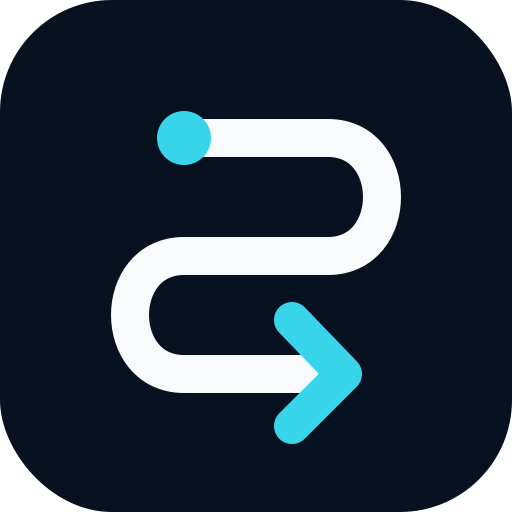

AIR-TRAFFIC · AI CONTROL PLANE

<h1>One control plane for all of AI.</h1>

Govern, observe, and budget <b>every</b> AI vendor and agent platform from one tower — natively where they allow it, enforced where they don't, and monitored where neither is possible.

OpenAI · Anthropic · Google · AWS · Azure · Microsoft · Mistral · Cohere · Meta · Databricks · IBM · Groq · Together · Perplexity · GitHub Copilot · xAI — one policy, one ledger, one audit trail.

Air-Traffic

Enterprise AI Control Plane &amp; Observability

Executive Overview · June 2026

<section class="spread">

01

Coverage
<h1>Every vendor. One honest model.</h1>

OpenAI

OpenAI

Claude

Anthropic Claude

Gemini

Google Vertex

Azure

Azure OpenAI

aws

AWS Bedrock

Mistral

Mistral AI

cohere

Cohere

Meta

Meta Llama

databricks

Databricks

watsonx

IBM watsonx

Groq

Groq

Together

Together AI

Perplexity

Perplexity

xAI

xAI Grok

Copilot

GitHub Copilot

Microsoft

Microsoft 365

VendorNative

Drive the vendor's own admin API.

EnvManaged

Push managed config into the environment.

ProxyEnforced

Optional inline gateway, off by default.

MonitorOnly

Verify &amp; alert — never faked as enforced.

<b>Native</b> where they allow it. <b>Enforced</b> where they don't. <b>Monitored</b> — never faked — where neither is possible.

16+

vendors

4

mechanisms

1

policy

</section>

<section class="spread">

02

One tower, three jobs
<h1>Safety. Visibility. Budget.</h1>

<svg viewBox="0 0 24 24" fill="none" stroke="#fff" stroke-width="2" stroke-linejoin="round" stroke-linecap="round"><path d="M12 22s8-4 8-10V5l-8-3-8 3v7c0 6 8 10 8 10z"/><path d="m9 12 2 2 4-4"/></svg>

GovernSafety &amp; governance

<b>Pick a rigor level</b> per surface — we apply it to every vendor, natively or via managed config.

🔒<b>Standard</b>

🔒🔒<b>Elevated</b>

🔒🔒🔒<b>Strict</b>

SaaSFintechHealthcare

One-click industry baselines — then fine-tune anything.

<svg viewBox="0 0 24 24" fill="none" stroke="#fff" stroke-width="2" stroke-linejoin="round" stroke-linecap="round"><path d="M2 12s3.5-7 10-7 10 7 10 7-3.5 7-10 7-10-7-10-7Z"/><circle cx="12" cy="12" r="3"/></svg>

ObserveVisibility

<b>One normalized stream</b> — model calls, agent actions, audit &amp; drift, every vendor. SIEM- &amp; OTel-ready.

<code>gpt-4o</code> model callOK

<code>mcp:github</code> tool callENV

<code>claude-code</code> hookPASS

<code>azure</code> filterBLOCK

<code>bedrock</code> retentionDRIFT

<code>copilot</code> review gateA

<svg viewBox="0 0 24 24" fill="none" stroke="#fff" stroke-width="2" stroke-linejoin="round" stroke-linecap="round"><path d="M12 1v22"/><path d="M17 5H9.5a3.5 3.5 0 0 0 0 7h5a3.5 3.5 0 0 1 0 7H6"/></svg>

ControlBudget &amp; spend

<b>One ledger</b> across every vendor; soft caps alert, hard caps stop overspend — even where the vendor has none.

OOpenAI<i style="width:100%"></i>$11K

AzAzure<i style="width:61%"></i>$6.8K

awsBedrock<i style="width:37%"></i>$4.1K

CClaude<i style="width:21%"></i>$2.3K

<i style="width:49%"></i>

<b>$24.4K</b> of $50K cap · alert at 80%

Set the posture once; Air-Traffic applies it across all 16 — and shows you <b>exactly how</b> each control is enforced.

3

planes

1

policy

0

proxies by default

</section>

<section class="spread last">

03

The control room
<h1>Proof, at a glance.</h1>

Air-Traffic · Flight Deckpolicy: Fintech 🔒🔒 · 16 vendors · synced 12s ago

<table>
<tr><th>Vendor</th><th>Policy</th><th>Strongest control</th><th>Spend MTD</th><th>Drift</th></tr>
<tr><td class="v">OpenAI&nbsp;</td><td>✓ synced</td><td>Spend alerts + audit Native</td><td>$11.2K</td><td>none</td></tr>
<tr><td class="v">Claude&nbsp;Anthropic Claude</td><td>✓ synced</td><td>MCP + hooks Env</td><td>$2.3K</td><td>none</td></tr>
<tr><td class="v">Azure&nbsp;Azure OpenAI</td><td>✓ synced</td><td>Content filters Native</td><td>$6.8K</td><td>none</td></tr>
<tr><td class="v">aws&nbsp;AWS Bedrock</td><td>✓ synced</td><td>Guardrails Native</td><td>$4.1K</td><td>none</td></tr>
<tr><td class="v">Copilot&nbsp;GitHub Copilot</td><td>✓ synced</td><td>Review gate Env</td><td>seats</td><td>none</td></tr>
<tr><td class="v">Gemini&nbsp;Google Vertex</td><td>⚠ 1 gap</td><td>Model Armor Native</td><td>$1.9K</td><td>safety unset</td></tr>
</table>

16+

vendors &amp; agent platforms, one plane

1

policy, ledger &amp; audit trail

100%

of activity visible &amp; attributable

5 min

to apply a baseline everywhere

One control plane for all of AI.Safety you can prove. Visibility you can act on. Spend you can control.

Air-Traffic · Enterprise AI Control Plane &amp; Observability · June 2026 — Vendor marks shown for identification only and remain the property of their respective owners (official glyphs via simple-icons; brand-color wordmarks where no glyph exists). Figures illustrative.

</section>
