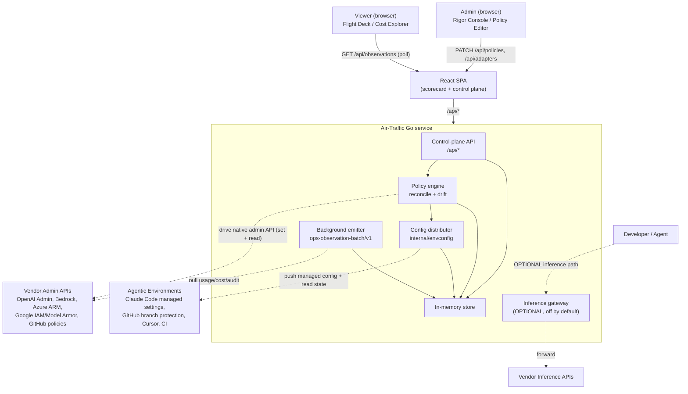
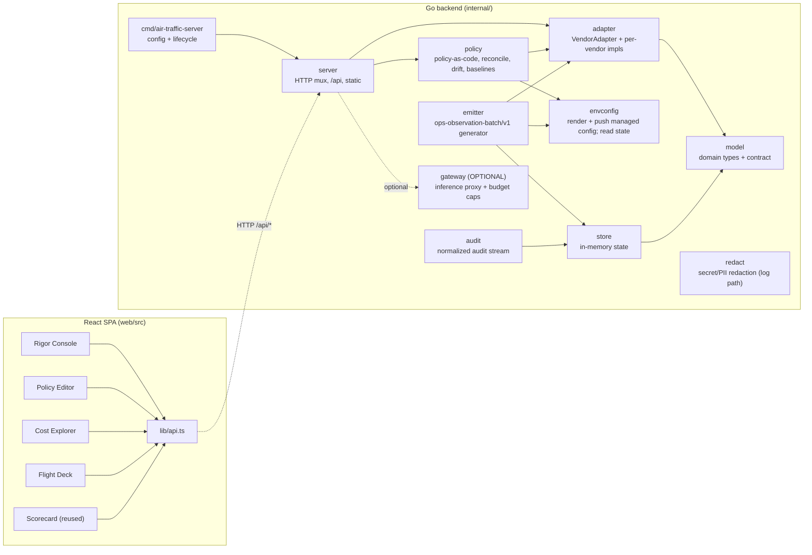
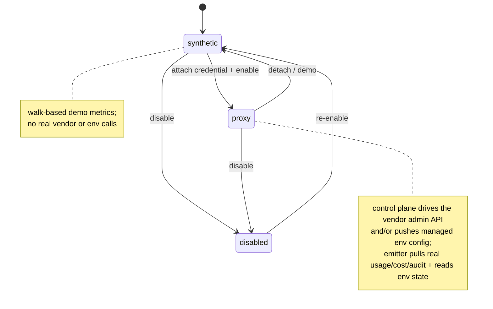
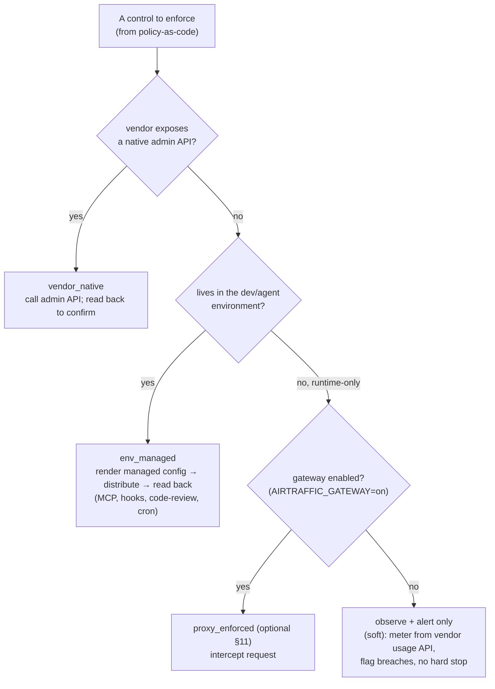
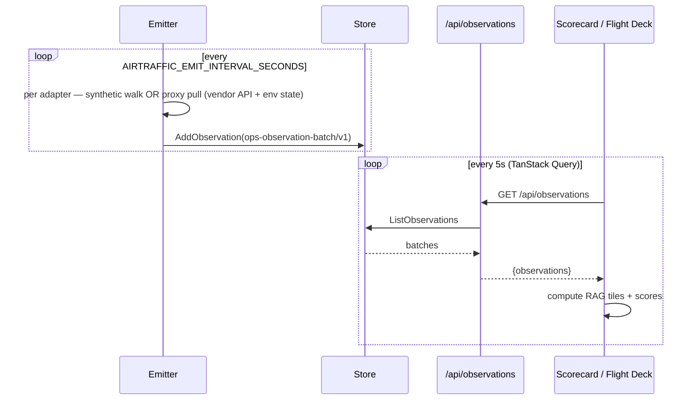
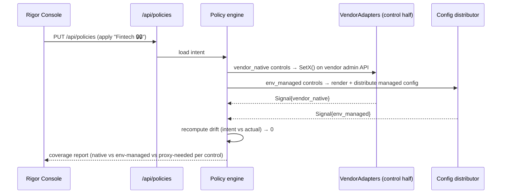
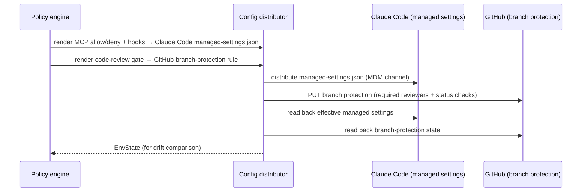
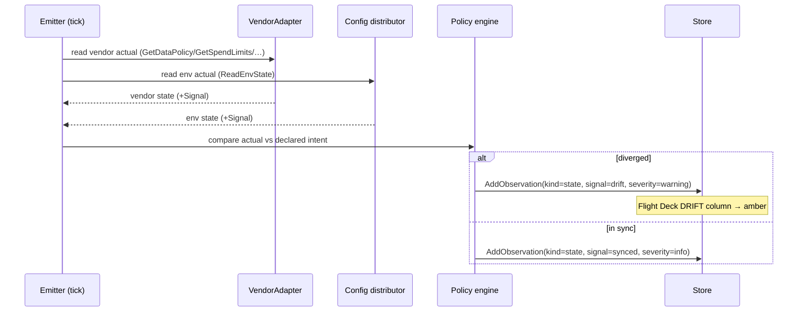
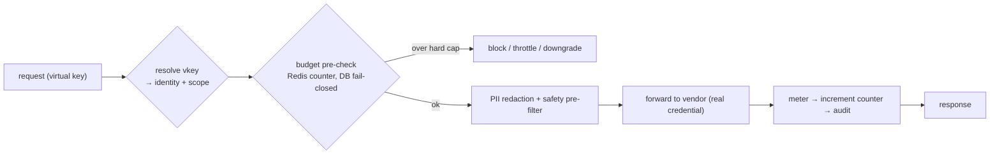

# Air-Traffic — System Design Plan

> **Scope:** Build-ready system design for **Air-Traffic**, an enterprise AI **control plane
> and observability layer**. Air-Traffic governs AI vendors and agentic developer platforms
> two ways: it **drives each vendor's native admin API** to set and read controls, and it
> **distributes managed configuration into developer/agent environments** (MCP allow/deny,
> shared hooks, code-review gates, cron) and reads that state back. It then **monitors** the
> whole estate through one normalized signal. It is the engineering companion to the
> research/product spec in [`air-traffic-analysis.md`](./air-traffic-analysis.md).
>
> **What Air-Traffic is NOT (by design):** it is **not** an inline inference proxy on the
> critical path of every model call. Routing all developer/agent traffic through a gateway is
> a separate, heavier concern with real operational cost (key reissuance, streaming, latency,
> per-vendor request shapes, SPOF). That capability exists here only as an **optional, clearly
> bounded module** (§11) for the handful of controls that genuinely cannot be done any other
> way. The spine is control + config + observability.
>
> **Architectural anchor:** Air-Traffic is a sibling of the `it-scorecard` repo and reuses its
> proven shape — a Go HTTP service exposing a **control plane** + a **background emitter** that
> produces a normalized `ops-observation-batch/v1` signal, with a React SPA on top. it-scorecard
> configures connectors and emits signal; Air-Traffic does the same, and adds a **config
> distributor** for agentic environments. (`/Users/justinhiggins/Projects/it-scorecard`.)

---

## Table of Contents

1. [Overview](#1-overview)
2. [Architecture](#2-architecture)
3. [Core Concepts](#3-core-concepts)
4. [Components](#4-components)
5. [The VendorAdapter Contract](#5-the-vendoradapter-contract)
6. [Enforcement Mechanisms](#6-enforcement-mechanisms)
7. [Data Flows](#7-data-flows)
8. [Policy-as-Code & Drift Detection](#8-policy-as-code--drift-detection)
9. [Observability & the Normalized Audit Stream](#9-observability--the-normalized-audit-stream)
10. [External Integrations](#10-external-integrations)
11. [Optional Module: the Inference Gateway](#11-optional-module-the-inference-gateway)
12. [Deployment](#12-deployment)
13. [Key Design Decisions & Risks](#13-key-design-decisions--risks)
14. [Build Sequence (Roadmap)](#14-build-sequence-roadmap)
15. [Appendix: Repository Layout](#15-appendix-repository-layout)

---

## 1. Overview

Air-Traffic gives an enterprise **one surface** to govern and observe AI usage across every
major vendor (OpenAI, Anthropic, Google Vertex, AWS Bedrock, Azure OpenAI, GitHub Copilot,
M365 Copilot, Cohere, Mistral, …) **and** the agentic developer platforms their engineers use
(Claude Code, GitHub Copilot, Cursor, CI). It does this through three cooperating parts inside
a single Go process:

1. **Control-plane API** (`/api/*`) — the admin surface. CRUD over vendor adapters, policies,
   industry baselines, and credentials. When a policy changes, the control plane **drives each
   vendor's native admin API** (OpenAI Admin API, Bedrock, Azure ARM, Google IAM/Model Armor,
   GitHub Copilot policies, …) to set the control, and reads it back to confirm.

2. **Config distributor** (`internal/envconfig`) — for controls that live in the *developer/agent
   environment* rather than a vendor API, Air-Traffic **renders managed configuration and
   distributes it** to the environment (e.g. Claude Code managed settings, GitHub branch
   protection, Cursor admin settings, CI), then **reads the effective state back** for drift.
   This is how MCP allow/deny, shared hooks, code-review gates, cron, and per-environment model
   assignment are governed — **no request interception required.**

3. **Background emitter + observability** — every tick, emit one `ops-observation-batch/v1`
   batch per adapter so the scorecard has live, moving signal. In **synthetic** mode it produces
   walk-based demo metrics (identical to it-scorecard's `emitSynthetic`); in **proxy** mode it
   pulls real usage/cost/audit from the vendor admin APIs and reads back environment config
   state.

A **policy engine** ties them together: it reconciles declared policy-as-code (intent) against
observed vendor + environment state (actual), and continuously emits **drift** observations
when they diverge.

> **Optional, not core:** an **inference gateway** (§11) can additionally sit in the request
> path to enforce the residual runtime-only controls — hard per-user *cross-vendor* spend caps
> and per-request PII redaction. It is a bounded add-on, off by default, and nothing in the
> spine depends on it.

**At a glance**

- **Backend:** Go (stdlib-first, mirroring it-scorecard's zero-dependency posture).
- **Frontend:** Vite + React + TypeScript + Tailwind + TanStack Query (same stack as it-scorecard `web/`).
- **Contract:** `ops-observation-batch/v1` — reused verbatim from it-scorecard so AI-plane tiles render in the same scorecard infrastructure.
- **Three adapter modes:** `disabled` · `synthetic` · `proxy` (mirrors it-scorecard `internal/model/model.go` `Mode`).
- **Three control dispositions:** `vendor_native` · `env_managed` · `proxy_enforced` (the last is the optional gateway). Plus `unverified` / `unsupported`.

---

## 2. Architecture

### 2.1 Context diagram

An **admin** configures policy; the control plane fans out to each vendor's **admin API** and
pushes **managed config** into the agentic environments; a **viewer** watches the scorecard. The
optional inference path (developer/agent → gateway) is shown dashed because it is not part of
the spine.



### 2.2 Module diagram

The Go backend is the it-scorecard shape extended with `envconfig`, `policy`, and `audit`. The
`gateway` + `budget` (hard-cap) packages are present but **optional**.



### 2.3 Adapter mode state

Each adapter moves between three modes, set from the control plane — identical semantics to
it-scorecard's connector modes.



---

## 3. Core Concepts

### 3.1 The three modes (reused from it-scorecard)

| Mode | Control plane | Config distributor | Emitter |
|---|---|---|---|
| `disabled` | no-op | no-op | silent |
| `synthetic` | echoes config locally; no vendor call | renders config but does not push | walk-based metrics |
| `proxy` | drives the vendor's native admin API | pushes managed config + reads state | pulls real usage/cost/audit |

Synthetic mode makes Air-Traffic demoable from the first commit with zero credentials — exactly
how it-scorecard ships live tiles with no upstreams.

### 3.2 The control dispositions (the honesty layer)

Every capability an adapter exposes carries a disposition. This is the Air-Traffic analog of
it-scorecard's `proxy_not_normalized` signal — it never fabricates a green and is always explicit
about *which mechanism* fulfils a control.

| Disposition | Mechanism | Where it executes | Examples |
|---|---|---|---|
| `vendor_native` | call the vendor admin API | control plane → vendor admin API | model_permissions, Bedrock Guardrails, spend_alerts, audit export, content filters |
| `env_managed` | push managed config into the environment, read it back | config distributor → agentic platform | MCP allow/deny, shared hooks, code-review gate, cron, per-env model assignment |
| `proxy_enforced` | intercept the request (OPTIONAL gateway) | data plane → gateway (§11) | hard per-user *cross-vendor* $ cap at call time, per-request PII scrub |
| `monitor_only` | verify / gate / alert — no *set* mechanism | emitter + policy engine | contractual training opt-out, ZDR-via-DPA, vendor-side retention/residency, soft spend alerts, read-only audit gaps |
| `unverified` | could not confirm from vendor/platform docs | surfaced as amber, not asserted | — |
| `unsupported` | platform explicitly cannot do this | surfaced, excluded from baselines | — |

> The single most important correction over a naive design: **agentic primitives (MCP/hooks/
> code-review/cron) are `env_managed`, not `proxy_enforced`.** They are governed by distributing
> managed configuration into the environment and reading it back — not by intercepting traffic.
> This is why the spine needs no inference gateway.

### 3.3 How `env_managed` actually works — and its enforcement-confidence tiers

The config distributor renders a platform-specific managed-config artifact, distributes it, and
reads the effective state back. **Enforcement strength is not binary** — research across the
agentic platforms (verified June 2026) shows three tiers, and Air-Traffic must track an
**enforcement-confidence level per `(control × platform × device)`** rather than a flat "enforced."

**Tier A — Server-side enforced (strongest; non-bypassable, needs no client cooperation).** The
control is enforced on the vendor's servers, so a developer cannot override it locally:

| Control | Platform mechanism | Read-back |
|---|---|---|
| Code-review gate + **test-coverage gate** | **GitHub / GitLab branch protection & rulesets** (required reviewers, required status checks; enforced at merge) | branch-protection / rulesets REST API |
| MCP allow/deny | **GitHub Copilot** registry-only allowlist (server-side); **GitLab Duo** cascading lock | audit log; content-exclusion API |
| Feature/model gating | GitLab Duo (`lock_duo_features_enabled`), Gemini admin controls, Cursor Enterprise (Privacy Mode + model allowlist), Amazon Q (SCP gating) | settings / admin API; CloudTrail |

**Tier B — Locked client config via OS/MDM (admin-enforced *iff* the device is MDM-managed).**
A managed file at an OS path takes top precedence over user/project settings:

| Control | Platform mechanism | Read-back |
|---|---|---|
| MCP allow/deny, hooks, permissions, agent/skill exec | **Claude Code** `managed-settings.json` (macOS `/Library/Application Support/ClaudeCode/`, Linux `/etc/claude-code/`, Windows `C:\Program Files\ClaudeCode\`; `managed-settings.d/` drop-ins) — `allowedMcpServers`/`deniedMcpServers`/`allowManagedMcpServersOnly`, `allowManagedHooksOnly`, `allowManagedPermissionRulesOnly`, `disableSkillShellExecution` | `claude doctor` (effective setting + source) |
| MCP/extension access, agent mode, telemetry | **VS Code** enterprise policies (Windows ADMX → registry, Intune, macOS `.mobileconfig`) — `ChatMCP`, `ChatAgentMode`, `AllowedExtensions`, `Claude3PIntegration`/`Codex3PIntegration` | policy/registry state |
| ZDR, feature disable, RBAC | **Windsurf (Codeium)** admin console policy lock | audit logs |

> **Hard dependency:** Tier-B locks require **MDM enrollment** (Jamf / Intune / Kandji) to deploy
> the managed file. On an *unmanaged* device the same controls silently degrade to Tier C. So the
> product must verify MDM coverage before claiming Tier-B enforcement.

**Tier C — Seed + drift-detect only (user *can* override).** Local client-file settings outside
the locked set (Cursor local MCP/dotfiles, JetBrains fine-grained config, any unmanaged device).
Air-Traffic distributes the config and **detects drift**, but cannot prevent override.

**Design rule (`internal/envconfig`):** every `env_managed` capability is emitted with an
`enforcement` field ∈ `{server_side, mdm_locked, seed_only}`. The UI renders `server_side` and a
*verified-managed* `mdm_locked` device as **green (enforced)**; an `mdm_locked` control on an
**unverified-MDM** device and all `seed_only` controls render **amber (monitored, not enforced)** —
**a Tier-C control is never shown as "enforced."** Lead baselines with Tier-A controls for
guaranteed enforcement; gate Tier-B controls behind an MDM-coverage check.

---

## 4. Components

> File paths are the proposed Air-Traffic layout. "Mirrors X" points at the it-scorecard file the
> design is lifted from.

### `cmd/air-traffic-server` — entrypoint
- **Responsibility:** parse config, wire store + server + emitter + policy engine + config distributor, run HTTP with graceful shutdown.
- **Config (env):** `AIRTRAFFIC_ADDR`, `AIRTRAFFIC_EMIT`, `AIRTRAFFIC_EMIT_INTERVAL_SECONDS`, `AIRTRAFFIC_STORE`, `AIRTRAFFIC_GATEWAY` (`off` by default).
- **Mirrors:** `cmd/harness-server/main.go`.

### `internal/server` — HTTP layer
- **Responsibility:** route registration for `/api/*` (control plane), static SPA serving, panic recovery. Mounts the optional `/gw/*` only when `AIRTRAFFIC_GATEWAY=on`.
- **Routes:** `/api/adapters`, `/api/adapters/{id}`, `/api/policies`, `/api/baselines`, `/api/credentials`, `/api/observations`, `/api/audit`, `/api/drift`, `/api/envconfig` (rendered artifacts + read-back state).
- **Mirrors:** `internal/server/server.go`, `routes.go`.

### `internal/adapter` — vendor + platform adapters ⭐
- **Responsibility:** the `VendorAdapter` interface (§5) and one implementation per vendor/platform (`openai.go`, `anthropic.go`, `bedrock.go`, `azure.go`, `vertex.go`, `github_copilot.go`, `m365_copilot.go`, `cohere.go`, `mistral.go`, `claude_code.go`, …). Each ships an `AdapterManifest` of `CapabilityEntry` with dispositions — the machine-readable form of the analysis doc's vendor tables.
- **Two halves per adapter:**
  - *Control half* — get/set policy by calling the vendor admin API (`vendor_native`).
  - *Env half* — `RenderManagedConfig()` + `ReadEnvState()` for `env_managed` controls (the agentic-platform adapters lean on this half).

### `internal/envconfig` — config distributor ⭐
- **Responsibility:** render platform-specific managed-config artifacts (Claude Code managed settings, GitHub branch-protection rules, etc.), distribute them through the configured channel (MDM endpoint, platform API, git commit), and read effective state back for drift.
- **Key files:** `render.go` (policy → artifact per platform), `distribute.go` (push channels), `readback.go` (effective-state fetch).
- **New concept (no it-scorecard equivalent):** this is the agentic-governance heart of the product.

### `internal/policy` — policy engine ⭐
- **Responsibility:** load policy-as-code (YAML/JSON), reconcile intent vs actual across **both** the vendor-API surface and the env-config surface, compute drift, and hold the **baseline profiles** library (General SaaS 🔒, Fintech 🔒🔒, Healthcare 🔒🔒🔒, Gov 🔒🔒🔒).
- **Key files:** `policy.go`, `reconcile.go`, `drift.go`, `baselines.go`.

### `internal/emitter` — background signal
- **Responsibility:** per tick, emit one `ops-observation-batch/v1` per adapter. Synthetic = walk (reuse it-scorecard's `walk`/`metricDef`); proxy = pull vendor usage/cost/audit + read env-config state. Also emits drift observations from the policy engine.
- **Mirrors:** `internal/emitter/emitter.go`, `catalog.go`; the proxy branch gains real vendor-API + env-state normalizers (the gap it-scorecard explicitly left open).

### `internal/audit` — normalized audit stream ⭐
- **Responsibility:** ingest vendor-native audit events (OpenAI Audit Logs + ChatGPT Enterprise Compliance Logs, Azure Activity Log, GitHub Audit Log incl. 2026 agentic events, CloudTrail, M365 Purview, Google Reports API) + config-distribution events, normalize into one `ops-observation-batch/v1`-shaped stream (OTel GenAI semconv) with `plane`/`vendor`/`control_surface` dimensions; expose `/api/audit` + SIEM export.

### `internal/store` — state
- **Responsibility:** in-memory store of adapters, credentials (by reference), policies, baselines, rendered env artifacts + read-back state, observation batches, audit events, activity log. Mirrors `internal/store/store.go`.

### `internal/model` — domain + contract
- **Responsibility:** domain types + `ObservationContract` (reused), plus Air-Traffic additions: `Plane`, `Disposition`, `CapabilityEntry`, `AdapterManifest`, `Policy`, `ManagedArtifact`.

### `internal/redact` — safety
- **Responsibility:** secret/PII redaction before any storage (reused from it-scorecard). *(Request-path PII redaction lives in the optional gateway, §11.)*

### `internal/secrets`, `internal/identity` — stubs → real
- **Responsibility:** resolve credential references (`secrets`), authenticate admins + distribution-channel auth (`identity`). Stubs initially (as in it-scorecard), wired to a KMS/IdP at the hardening phase.

### `internal/gateway` — inference proxy (OPTIONAL) 
- See §11. Compiled in but mounted only when `AIRTRAFFIC_GATEWAY=on`. Nothing in the spine imports it.

### `web/` — React SPA
- **Responsibility:** the four control surfaces (Rigor Console, Policy Editor, Cost Explorer, Flight Deck) + the reused scorecard. Mirrors it-scorecard `web/`.

---

## 5. The VendorAdapter Contract

The full Go interface is in
[`air-traffic-analysis.md` §5](./air-traffic-analysis.md#5-air-traffic-api-vendoradapter-architecture).
Every adapter implements method groups across the planes, plus the two halves:

- **Control half (`vendor_native`):** `ListModels`, `SetModelAccess`, `GetDataPolicy/SetDataPolicy`, `GetContentSafetyPolicy/SetContentSafetyPolicy`, `GetSpendLimits/SetSpendLimits`, `GetUsage`, `GetAuditLogs`, `GetUsageMetrics` — each calling the vendor admin API.
- **Env half (`env_managed`):** `RenderManagedConfig(policy) → ManagedArtifact` and `ReadEnvState() → EnvState` — for the agentic-platform controls (MCP, hooks, code-review, cron).
- **Emission:** `Emit(ctx, ts) → model.ObservationRecord` (the it-scorecard contract).

Every method returns a `Signal{Disposition, Code, Message, Retryable}` so the caller always knows
whether the outcome came from the vendor API (`vendor_native`), an env-config push (`env_managed`),
or — only in the optional gateway — request interception (`proxy_enforced`). This is the
load-bearing honesty primitive, the same role `proxy_not_normalized` plays in it-scorecard.

> Note there is **no `Forward()` in the core interface.** Request forwarding belongs to the
> optional gateway adapter (§11), keeping the spine free of the inference path.

---

## 6. Enforcement Mechanisms

Air-Traffic enforces a control through whichever of three mechanisms fits — and says which:



The decisive design point: **only the bottom-right leaf needs the inference gateway.** Everything
the user's core product targets — vendor controls and agentic primitives — resolves to
`vendor_native` or `env_managed`, neither of which touches the request path. Where a runtime-only
control (hard cross-vendor cap, per-request PII scrub) is in policy but the gateway is off,
Air-Traffic degrades **honestly** to observe-and-alert rather than silently claiming enforcement.

---

## 7. Data Flows

### 7.1 Live emit → scorecard (reused from it-scorecard)



### 7.2 Admin applies a baseline → reconcile across both surfaces



### 7.3 Agentic config push + read-back (the core agentic flow)



### 7.4 Drift detection loop



---

## 8. Policy-as-Code & Drift Detection

A single declarative document is the source of truth for intent across all three planes and both
surfaces (vendor API + env config). The reconciler converges actual→intent; the drift detector
reports divergence.

```yaml
# air-traffic-policy.yaml
baseline: fintech-elevated          # one-click industry baseline, then override below
vendor_defaults:
  training_opt_out: true            # vendor_native where available
  content_safety: elevated          # vendor_native (Azure/Bedrock/Model Armor) else observe
  data_retention_days: 7
vendors:
  openai:
    model_access: { mode: allow_list, allowed_models: [gpt-4o, gpt-4o-mini, o3-mini] }  # vendor_native
    spend_alerts: { threshold_cents: 5000000 }                                          # vendor_native (soft)
  bedrock:
    content_safety: { guardrail_id: g-12345abc, apply_cross_account: true }             # vendor_native
agentic:                            # env_managed — pushed into dev/agent environments
  claude_code:
    mcp:
      allow: [filesystem, git, internal-db-readonly]
      deny: ["*"]                    # default-deny, allow-list above
    hooks:
      pre_commit: [run-tests, secret-scan]
    managed_settings_locked: true    # admin-controlled; user cannot override
  github:
    code_review:
      require_human_review: true     # branch protection: required reviewers
      required_status_checks: [tests, coverage-90]
budget:
  org_monthly_cap_usd: 50000         # vendor_native soft caps + cross-vendor MONITOR by default;
                                     # hard cross-vendor enforcement only if gateway enabled (§11)
  per_user_cap_usd: 500              # observe + alert by default; proxy_enforced if gateway on
```

**Reconcile algorithm (`internal/policy/reconcile.go`):**
1. Resolve effective intent = baseline ⊕ overrides.
2. For each `(target, control)`: read actual; if `vendor_native`, call `SetX()` on the vendor API;
   if `env_managed`, render + distribute the managed artifact; record the `Signal`.
3. Emit a **coverage report**: per control, native vs env-managed vs proxy-needed vs unverified.

**Drift (`internal/policy/drift.go`):** the emitter periodically re-reads actual state from both
surfaces. Any `(target, control)` whose actual ≠ intent emits a `drift` observation (amber). Drift
sources: a console side-change, a vendor default change, a developer overriding a *seeded* (not
locked) managed setting, credential rotation that silently disables a `vendor_native` control, or a
new environment added without policy coverage.

---

## 9. Observability & the Normalized Audit Stream

Air-Traffic mirrors the three control planes in observability and unifies everything into the
single `ops-observation-batch/v1` contract.

- **Budget plane:** tokens/cost per vendor/model/team from vendor usage APIs; cap utilization
  computed by Air-Traffic. (Per-user *enforcement* is optional/proxy, but per-user *attribution*
  comes from vendor logs like Bedrock `identity.arn` + Application Inference Profiles.)
- **Data-policy plane:** content-safety triggers (vendor-native where available), ZDR compliance,
  drift events.
- **Developer-workflow plane:** MCP allow/deny state, hook config, code-review gate state, and
  **agentic action logs from the platforms' own audit surfaces** (GitHub 2026 agentic audit events,
  Claude Code telemetry, ChatGPT Enterprise Compliance Logs) — read, normalized, not intercepted.

**Schema — OpenTelemetry GenAI semantic conventions.** The normalized stream maps its
`ops-observation-batch/v1` dimensions onto OTel GenAI semconv attributes (`gen_ai.system`,
`gen_ai.request.model`, `gen_ai.usage.input_tokens`/`output_tokens`, …) so it is ingestible by any
OTel/SIEM consumer (Datadog, Splunk, Elastic) and deep per-span tracing can be **offloaded to
Langfuse via its OTLP endpoint** rather than rebuilt.

**Normalized audit event** (one shape for vendor-native + env-config + (optional) gateway events):

```json
{
  "id": "...", "timestamp": "...", "actor": "user:jdoe", "action": "mcp.policy.set",
  "resource": "claude-code:internal-db-readonly", "plane": "developer_workflow",
  "vendor": "claude_code", "control_surface": "env_managed",
  "before": {"allow": ["filesystem"]}, "after": {"allow": ["filesystem","internal-db-readonly"]},
  "request_id": "req-..."
}
```

---

## 10. External Integrations

| Name | Protocol | Direction | Surface | Notes |
|---|---|---|---|---|
| Browser SPA | HTTP/JSON | inbound | `/`, `/settings/*`, `/api/*` | scorecard + 4 control surfaces |
| Vendor **admin** APIs | HTTPS | outbound (proxy mode) | per-adapter | drives `vendor_native` controls + pulls usage/cost/audit |
| **Agentic environments** | HTTPS / MDM / git | outbound (proxy mode) | Claude Code managed settings, GitHub branch-protection + policy API, Cursor, CI | `env_managed` push + read-back |
| SIEM (Splunk/Elastic/Datadog) | HTTP/webhook | outbound (opt-in) | audit export | normalized stream (OTel GenAI semconv) |
| Langfuse (deep tracing) | OTLP | outbound (opt-in) | `/api/public/otel` | offload per-span tracing |
| Secret manager / KMS | — | outbound (intended) | `internal/secrets` | resolves credential references |
| IdP (SSO/SCIM) | — | outbound (intended) | `internal/identity` | admin auth + distribution-channel auth |
| Vendor **inference** APIs | HTTPS | outbound (**optional gateway only**) | per-adapter | only when `AIRTRAFFIC_GATEWAY=on` |

Synthetic mode keeps **all** outbound integrations opt-in — the service is fully functional and
demoable with zero credentials, exactly like it-scorecard.

---

## 11. Optional Module: the Inference Gateway

> **Status: optional, off by default (`AIRTRAFFIC_GATEWAY=off`). Not on the spine.** Build only if
> the residual runtime-only controls below are a hard requirement.

Some controls cannot be done by calling a vendor API or pushing environment config — they require
being *in the request path* at call time. There are essentially two:

1. **Hard, cross-vendor, per-user spend caps** — stop a user mid-request when their budget is gone,
   *even on a vendor with no native cap* (AWS Bedrock has none; AWS itself prescribes a proxy).
2. **Per-request PII/PHI redaction** of arbitrary outbound traffic (e.g. healthcare baseline).

Everything else — including *monitoring* spend, *setting* a vendor's native cap, *soft* alerts, and
all agentic governance — needs no gateway.

**If enabled**, the gateway is the standard AI-gateway pattern (validated against LiteLLM / Portkey
/ Kong): an OpenAI-compatible ingress, **virtual keys** that map to real vendor credentials and a
policy scope, a **Redis cross-pod spend counter with DB fail-closed**, ordered guardrail hooks
(PII, content-safety), and **threshold actions** (alert / throttle / downgrade-model / block).
Developers point their SDK `base_url` at Air-Traffic and authenticate with a virtual key; the
gateway enforces, swaps in the real credential, meters, and audits.



**Operational cost to be honest about:** this makes Air-Traffic latency-critical and a potential
SPOF, requires reissuing/rotating vendor keys so the gateway is the only path, and requires
per-vendor request-shape + streaming handling. That cost is exactly why it is **opt-in**, not the
foundation.

---

## 12. Deployment

### Runtime topology
- **Single Go process** serving the control plane, config distributor, emitter, and static SPA. The optional gateway mounts only when enabled.
- **Frontend:** dev via Vite proxy; prod-style via `web/dist` served same-origin (mirrors it-scorecard).

### Configuration surfaces (env)
| Var | Default | Effect |
|---|---|---|
| `AIRTRAFFIC_ADDR` | `127.0.0.1:8120` | listen address |
| `AIRTRAFFIC_EMIT` | `on` | background emitter on/off |
| `AIRTRAFFIC_EMIT_INTERVAL_SECONDS` | `5` | emit tick cadence |
| `AIRTRAFFIC_STORE` | `memory` | `memory` \| `postgres` |
| `AIRTRAFFIC_GATEWAY` | `off` | mount the optional inference gateway (§11) |
| `AIRTRAFFIC_REDIS_URL` | _(empty)_ | gateway budget counters (only if gateway on) |

### Secrets handling
- Credentials stored **by reference** (`secret_ref`); plaintext rejected on write (reuse `internal/redact.HasPlaintextSecretKey`).
- Distribution-channel credentials (MDM, GitHub app, etc.) resolved through `internal/secrets`.
- Recorded calls + observation bodies redacted before storage.

---

## 13. Key Design Decisions & Risks

- **The spine never intercepts inference.** Governance is achieved by driving vendor admin APIs and
  distributing managed environment config — both off the request path. This is the deliberate scope
  decision (the inline gateway is optional, §11). Consequence: a handful of runtime-only controls
  (hard cross-vendor caps, per-request PII scrub) are **observe-and-alert** unless the optional
  gateway is enabled. The UI must label those as monitored-not-enforced so the posture is never
  overstated.

- **`env_managed` enforcement strength is tiered (resolved — see §3.3).** Server-side controls
  (GitHub/GitLab rulesets, Copilot registry-only MCP, GitLab Duo, Gemini/Cursor/Amazon Q admin
  gating) are genuine, non-bypassable enforcement. OS/MDM-locked client config (Claude Code
  `managed-settings.json`, VS Code policies, Windsurf) is genuine **only on MDM-enrolled devices** —
  the single biggest caveat. Seed-only config is drift-detected, never "enforced." **Mitigation:**
  every `env_managed` capability carries an `enforcement` ∈ `{server_side, mdm_locked, seed_only}`;
  `mdm_locked` is gated behind a verified-MDM check; the UI renders Tier-C as monitored-not-enforced.

- **Read-back depends on each platform exposing effective config.** Drift detection needs to read
  the *actual* state. Where a platform offers no read API, drift on that control is `unverified`.

- **Proxy-mode normalizer is real per-adapter work.** it-scorecard left proxy normalization
  unimplemented; Air-Traffic must implement real vendor-API + env-state normalizers in each adapter.
  This is the bulk of per-adapter effort.

- **In-memory store loses state on restart.** Same posture as it-scorecard; Postgres for
  policies/audit at the hardening phase.

- **Vendor admin APIs drift and rate-limit.** Pulling usage/cost/audit every tick can hit vendor
  rate limits. **Mitigation:** per-vendor pull cadence + caching, decoupled from the 5s scorecard tick.

- **(Optional gateway only) durable, fail-closed budget counters.** If the gateway is enabled, its
  hard caps need Redis cross-pod counters with a DB fail-closed mode — a hard cap that silently
  fails open is worse than no cap because it reads as enforced.

- **Identity/secrets are stubs initially.** Same as it-scorecard; production needs a real IdP + KMS.

---

## 14. Build Sequence (Roadmap)

Each phase is independently demoable. Phases 0–1 reuse it-scorecard scaffolding almost verbatim;
the differentiated work is Phase 2 (config distributor) and Phase 3 (real vendor-API adapters).

| Phase | Goal | Key deliverables | Reuses from it-scorecard |
|---|---|---|---|
| **0 — Skeleton** | Service boots; scorecard renders AI tiles | `model`, `store`, `server`, synthetic `emitter`, scorecard SPA | ~80% verbatim |
| **1 — Adapters (synthetic)** | All vendors + platforms present as adapters with manifests | `adapter` iface + manifests; Rigor Console + Flight Deck read manifests | emitter/catalog pattern |
| **2 — Config distributor** ⭐ | Agentic primitives governed via env config | `envconfig` (render/distribute/readback) + per-capability `enforcement` tier; **start Tier-A server-side** (GitHub/GitLab rulesets, Copilot MCP registry), then Tier-B (Claude Code/VS Code, gated on MDM check) | — |
| **3 — Vendor-API adapters** ⭐ | Real vendor admin APIs driven + read | control half for Bedrock, Azure, OpenAI, Vertex, GitHub Copilot (most `vendor_native`) | proxy mode shape |
| **4 — Policy + drift** ⭐ | Policy-as-code, reconcile across both surfaces, drift, baselines | `policy` engine, baselines library, drift observations | — |
| **5 — Audit + observability** | One normalized audit stream (OTel GenAI) + SIEM export | `audit` package, audit normalizers per source, export | observation contract |
| **6 — Hardening** | Durable, authenticated | Postgres store, real `identity`/`secrets` | — |
| **7 — (Optional) Gateway** | Runtime enforcement of residual controls | `gateway` (virtual keys, Redis caps, guardrails) — only if required | — |

**Critical path:** Phases 2–4 are the differentiated core. The config distributor (Phase 2) is the
highest-value milestone — it is what makes Air-Traffic an *agentic* control plane and not just a
vendor-API dashboard. The gateway (Phase 7) is explicitly last and optional.

---

## 15. Appendix: Repository Layout

```
air-traffic/
├── cmd/
│   └── air-traffic-server/
│       └── main.go                 # config + lifecycle (mirrors harness-server)
├── internal/
│   ├── adapter/                    # ⭐ VendorAdapter + per-vendor/platform impls
│   │   ├── adapter.go              #   interface, Signal, Manifest types
│   │   ├── openai.go               #   control half (vendor API)
│   │   ├── anthropic.go
│   │   ├── bedrock.go
│   │   ├── azure.go
│   │   ├── vertex.go
│   │   ├── github_copilot.go       #   control half + env half (policies, branch protection)
│   │   ├── m365_copilot.go
│   │   ├── cohere.go
│   │   ├── mistral.go
│   │   └── claude_code.go          #   env half (managed settings: MCP, hooks)
│   ├── envconfig/                  # ⭐ render + distribute managed config; read state
│   │   ├── render.go
│   │   ├── distribute.go
│   │   └── readback.go
│   ├── policy/                     # ⭐ policy-as-code + reconcile + drift + baselines
│   │   ├── policy.go
│   │   ├── reconcile.go
│   │   ├── drift.go
│   │   └── baselines.go
│   ├── emitter/                    # ops-observation-batch/v1 generator (mirrors it-scorecard)
│   ├── audit/                      # ⭐ normalized audit stream (OTel GenAI semconv)
│   ├── store/                      # in-memory state (mirrors it-scorecard)
│   ├── model/                      # domain types + contract (extends it-scorecard)
│   ├── redact/                     # secret/PII redaction (log path)
│   ├── secrets/                    # credential + channel-auth resolution (stub → KMS)
│   ├── identity/                   # admin auth + user mapping (stub → IdP)
│   └── gateway/                    # OPTIONAL inference proxy (§11) — off by default
│       ├── pipeline.go
│       ├── vkey.go
│       └── meter.go
├── schemas/
│   └── ops-observation-batch-v1.schema.json   # reused verbatim
├── web/                            # React SPA (scorecard reused + 4 new surfaces)
│   └── src/
│       ├── pages/{RigorConsole,PolicyEditor,CostExplorer,FlightDeck}.tsx
│       ├── scorecard/              # reused verbatim
│       └── lib/api.ts
└── docs/
    ├── air-traffic-analysis.md        # research + product spec
    └── air-traffic-system-design.md   # this document
```

---

*Companion to [`air-traffic-analysis.md`](./air-traffic-analysis.md). Spine = vendor-API control +
environment config distribution + observability; inline inference gateway is an optional module.
Architecture anchored on the `it-scorecard` connector/emitter pattern. June 2026.*
