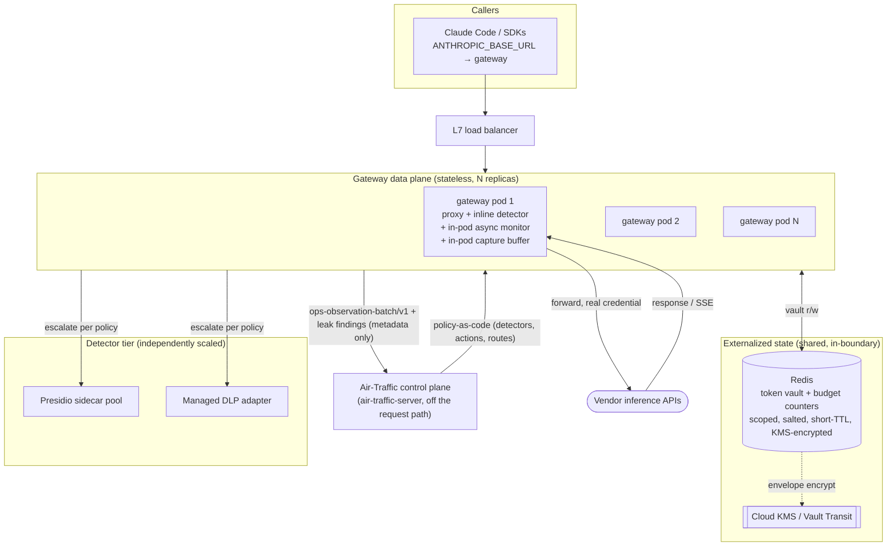

# Inference Gateway — Build Plan

*Companion to [`inference-gateway-design.md`](./inference-gateway-design.md). The design doc is the **what & why**; this is the **how, in what order, and how it fits & scales**. Vendor-neutral design stays in the design doc; this plan binds that design to the Air-Traffic system and a horizontally-scalable topology.*

**Status:** MVP slice **built** (2026-07-02): G0, G1, G2, partial-G6 (self-hosted Presidio tier), G7, plus a UI test harness tab and flywheel v0 — see [`plans/phase-3-inference-gateway.md`](./plans/phase-3-inference-gateway.md) for what shipped and [`plans/TODO-gateway-deferred.md`](./plans/TODO-gateway-deferred.md) for what's deliberately deferred (G3–G5, managed DLP, G8–G10-full). Same day, the G6 **config-knob slice** was pulled forward: deny-list and per-type score-threshold proposal kinds (probe-evidenced) plus context words on regex rules, wired through the flywheel's propose→approve→hot-reload path. `cmd/air-traffic-gateway` runs on 127.0.0.1:8125; Presidio sidecar on 8126.

**How to use this document:** every milestone in [§5](#5-build-milestones) is written as a **self-contained, independently-extractable work unit** — same template, explicit dependencies, its own acceptance criteria. Deconstruct it later by lifting one `G{n}` block into a ticket without needing the rest. [§8](#8-deconstruction-index) is the index that maps milestones → suggested work packages.

---

## Table of Contents

1. [Why we're building this (grounding in the design rationale)](#1-why-were-building-this-grounding-in-the-design-rationale)
2. [Architectural decision: separate data-plane service vs. in-process](#2-architectural-decision-separate-data-plane-service-vs-in-process)
3. [Target architecture (fit + horizontal scale)](#3-target-architecture-fit--horizontal-scale)
4. [Observability integration (explicit)](#4-observability-integration-explicit)
5. [Build milestones](#5-build-milestones)
6. [The lead-requirement MVP slice](#6-the-lead-requirement-mvp-slice)
7. [Cross-cutting concerns](#7-cross-cutting-concerns)
8. [Deconstruction index](#8-deconstruction-index)

---

## 1. Why we're building this (grounding in the design rationale)

Re-read of the design doc's "why" before any sequencing — the build order falls out of the rationale, not the other way around:

- **The gateway is the only thing that legitimately sits on the request path.** Everything Air-Traffic does today — driving vendors' native admin APIs (`vendor_native`), pushing managed config and reading it back (`env_managed`), emitting a normalized observation signal — is deliberately **off** the inference path. A small residue of controls *cannot* be done that way; they need to be **in the request at call time**: per-request PII/PHI redaction, and a hard cross-vendor mid-request spend stop. The gateway exists for exactly that residue, and nothing more (design §15; system-design §11; analysis §9.3 / §10).
- **It realizes a disposition the control plane already promises.** Air-Traffic's honesty model already has five dispositions, one of which is `proxy_enforced` — today it is a label with no enforcement behind it. The gateway is what makes `proxy_enforced` *true*. This is the cleanest possible "fit": we are not adding a concept, we are filling one in.
- **The genuinely hard parts are narrow and known** (design §3, §13): streaming correctness (PII split across SSE chunks) and detection recall (regex floor + real NER/DLP). Neither is research. The proxy core — rewrite JSON, swap a credential, forward — is small.
- **The differentiator is a measured recall ratchet on top of dual control** (design §11, §14). That is the one number proxy-only incumbents don't publish, and it's only reachable if the flywheel is designed in from the start (token binding, tee-don't-gate, surrogate-on-promotion).
- **The cost is real and is why it's opt-in** (design §13): the gateway makes you latency-critical, a SPOF, and the owner of per-vendor request-shape upkeep and a live PHI path. The build plan must therefore treat HA, fail modes, and horizontal scale as first-class, not afterthoughts.

**Trigger to build (from the handoff):** the concrete requirement most likely to land first is a **technically-enforced pre-coverage gate** — *"no PHI reaches the model until ZDR/BAA is on,"* enforced rather than policed by policy (e.g. a regulated health-plan org rolling out Claude Code). That requirement defines the [MVP slice in §6](#6-the-lead-requirement-mvp-slice).

---

## 2. Architectural decision: separate data-plane service vs. in-process

**Decision: build the gateway as a separate, independently-deployable, stateless data-plane service** (its own binary `cmd/air-traffic-gateway`, its own deploy unit and load balancer) — **not** as an in-process module of the control-plane server. It lives in the **same repository** and shares the `internal/model` contracts, but it is its own process.

> This supersedes the earlier framing (system-design §2.2 / §4) where the gateway was a compiled-in package mounted at `/gw/*` inside the single `air-traffic-server` process. That framing was correct for "optional, off, demo-grade"; it does **not** survive the horizontal-scale requirement. The decision below is the evolution, and the doc edits accompanying this plan update §2/§4/§11/§12 to match.

### Why separate wins (weighed against the horizontal-scale goal)

| Dimension | Control plane (air-traffic-server) | Gateway data plane | Verdict |
|---|---|---|---|
| **Scaling axis** | Low-QPS, read-mostly; scales with *vendors/orgs* (tens of req/s) | High-QPS; scales with *inference traffic* (can be orders of magnitude higher, bursty) | Orthogonal axes → co-locating forces you to scale the whole control plane to absorb an inference spike. **Separate.** |
| **Statefulness** | Happily single-node in-memory (`internal/store`, one `RWMutex`, 5000-cap FIFO rings) | Must be **stateless** with externalized state (Redis vault, KMS) to scale out at all | Forcing the gateway into the in-memory model makes it un-scalable; forcing the control plane to externalize everything is a needless rewrite. **Separate.** |
| **Failure domain / blast radius** | Off the request path; an outage degrades governance visibility, not inference | On the request path; a SPOF — an outage stops inference | Co-locating lets a control-plane bug take down inference (and vice-versa). The entire design ethos is "keep it off the spine." **Separate.** |
| **Dependency set** | Deliberately **stdlib-only, zero deps** | Needs Redis client, OTel SDK, detector clients | Co-locating pollutes the control plane's zero-dep purity. Separate binary keeps the control-plane dependency closure stdlib-only. **Separate.** |
| **Latency profile** | Best-effort; a 5s emitter tick is fine | Per-token streaming loop, p99-added-latency SLO | The hot path must not contend with emitter/drift goroutines for CPU/GC. **Separate.** |
| **Release cadence** | Changes with governance features | Changes with vendor request-shape drift, detector tuning | Independent deploy lets you ship a detector fix without redeploying the control plane. **Separate.** |

### What "fit" then means

Separate process, **one system**. The gateway is a data-plane *peer* that the control plane governs and observes through two contracts that already exist:

- **Policy flows down:** the control plane is the policy authority (`policy-as-code`, baselines). The gateway is a *policy enforcement point* that pulls its rules from the control plane.
- **Observations flow up:** the gateway emits the same `ops-observation-batch/v1` signal the synthetic emitter does, plus leak findings into the audit stream — so gateway activity lights up the existing Flight Deck / Observability / Cost / Audit screens with **no new UI**.

This is the textbook control-plane / data-plane split, and it is what lets the gateway scale horizontally while the design's "off the spine" principle is preserved.

### Honest caveat (don't oversell the separation)

For the **lead-requirement MVP** (low-volume pre-coverage gate, §6) you deploy a **single replica** of the separate service — same binary, just not scaled out. The win is that the *architecture* (stateless + externalized state) supports `1 → N` replicas the day volume justifies it, with **no rewrite**. "Separate service" is an architecture decision; "how many replicas" is a deployment dial. So the answer to *"maybe it'll run fine inside the app's plane"* is: keep it a separate process from day one, but you may run exactly one of it until traffic says otherwise.

---

## 3. Target architecture (fit + horizontal scale)

### 3.1 Topology



### 3.2 Components and where state lives

| Component | Placement | State | Scale story |
|---|---|---|---|
| **Proxy core / protocol adapters** | gateway pod | stateless | replicate behind L7 LB |
| **Inline detector (regex/RE2)** | in-process | stateless | scales with pods |
| **Credential broker** | gateway pod | secrets **by reference** (KMS), resolved per-call | stateless |
| **Token vault** | **Redis (shared)** | placeholder↔value, scoped+salted, short TTL, envelope-encrypted | shared so any pod can detokenize any conversation turn; Redis scales/HA independently |
| **Budget/rate counters** | **Redis (shared)** | per-caller counters, DB fail-closed | cross-pod correctness |
| **Async leak monitor** | **in-pod worker pool** (off hot path) | consumes capture buffer | scales with pods; raw payloads never leave the pod |
| **Capture buffer** | **in-pod, in-memory FIFO** | recent payloads keyed by `request_id`, TTL ≥ monitor p99 | per-pod working set; never durable, never shared, never to disk |
| **Heavy detector (Presidio / managed DLP)** | **separate tier** | stateless | own LB + autoscale; PHI stays in-boundary for self-hosted Presidio |
| **Audit / leak-finding sink** | control plane | findings = **metadata only** | rides the existing observation/audit pipeline |

### 3.3 The horizontal-scale invariants (what makes scale-out correct, not just possible)

1. **Pods are stateless.** All cross-request state is in Redis/KMS. A pod can die or be added mid-conversation without breaking correctness.
2. **Token stability is shared, not local.** Tokens are bound deterministically *within scope* (`HMAC(conversation_salt, value)`, design §7) and the map lives in the shared vault — so a conversation's turns landing on different pods still see the same `<PERSON_1>`. Sticky routing is a *cache optimization*, never a correctness requirement.
3. **Raw PHI is confined to two narrow places, both in-pod:** the seconds-long capture buffer and the live request in memory. Nothing durable, nothing shared, holds a raw value. Everything that leaves a pod is a **finding** (`{request_id, type, confidence, in_redaction_map}`) or a **synthetic surrogate** (surrogate-on-promotion, design §11).
4. **The monitor is co-located to keep PHI in-pod.** Running the async monitor as an in-pod worker (not a separate tier consuming a shared raw-payload queue) is a deliberate choice: it keeps raw payloads from ever transiting shared infrastructure. Only the *heavy detector* it calls is a separate, stateless tier — and for PHI that detector is self-hosted Presidio, in-boundary.
5. **Fail mode is explicit and uniform across pods** (`FAIL_MODE=open|closed`), so scale-out never changes the security posture.

---

## 4. Observability integration (explicit)

Two layers, deliberately distinct: the gateway's **own deep telemetry**, and its **integration into the Air-Traffic observability spine**. Both are consistent with the §2 decision (separate service): the gateway *emits upward* rather than sharing the control plane's in-memory store.

### 4.1 Native gateway telemetry (OpenTelemetry)

- **Traces** — one span tree per request: `auth → resolve-policy → parse → detect → redact → forward → (detokenize)`; the async monitor is a linked span off the trace. GenAI semantic conventions.
- **Metrics** — added latency `p50/p95/p99`, time-to-first-token (streaming), detector latency per engine, vault hit-rate, block-rate, redaction counts by type, fail-mode trips, monitor queue depth, throughput, memory under large payloads.
- **Logs** — structured JSON, **redaction-safe**: the *fact* and *type* of a detection, never the value. A standing CI regression scans log + audit output for raw PII (design §10) — "don't log what you redact" is enforced, not hoped.
- **Export** — OTel collector → whatever metrics/trace backend the deployment uses. The gateway owns this; it does not write to the control plane's in-memory store.

### 4.2 Integration into the Air-Traffic spine (the "fit")

The gateway speaks the contracts the control plane already consumes — so its activity appears on the existing screens with **zero new UI**:

| Gateway emits | Via | Surfaces on (existing screen) |
|---|---|---|
| `ops-observation-batch/v1` (redaction counts, latency, spend, recall) | `POST /api/observations` (same contract as the synthetic emitter) | **Flight Deck**, **Observability**, **Cost & Usage Explorer** |
| Leak findings (metadata only — `{request_id, type, confidence, in_redaction_map}`) | `LEAK_EVENT_SINK` → normalized audit stream | **Audit** (`GET /api/audit?format=siem`) |
| Enforcement status per capability | disposition update → `proxy_enforced` | **Policy Editor** (truthful enforcement chip; the gateway is what flips `monitor_only` → `proxy_enforced`) |
| The **recall ratchet** (`v3 catches 96.2% of held-out PHI, up from 91%`) | a first-class metric in the observation batch | **Flight Deck** KPI strip / **Observability** |

And consumes downward:

- **Policy** — the gateway pulls `GET /api/policies` (detectors, actions, routes, baselines). The control plane is the authority; the gateway enforces. A policy change in the Policy Editor propagates to gateway pods (poll or push) without a redeploy.
- **Drift** — the control plane already computes intent-vs-actual. It extends naturally: *intended* enforcement (policy says "healthcare route → tokenize-or-block") vs *actual* enforcement reported by the gateway → a drift event if a pod is mis-configured or unreachable.

**Net:** the observability integration is "**emit the existing batch contract upward, consume policy downward.**" No new screens, no new contract — the gateway becomes a first-class citizen of the spine it sits beside.

---

## 5. Build milestones

Each `G{n}` is self-contained and independently extractable. Template fields are identical across milestones so a downstream agent can lift one block into a ticket. Effort is relative (**S** ≈ ~1–2 units, **M** ≈ ~2–3, **L** ≈ open/iterative), not a calendar promise.

> **Mapping to the design doc:** `G1≈M1`, `G2≈M2`, `G3+G4+G5≈M3` (split for scale), `G6≈M4`, `G9≈M5`, `G10≈M6`. `G0`, `G7`, `G8` are new milestones this plan adds for the separate-service topology, spine integration, and observability depth.

### Phase A — Foundation (separate, stateless data-plane service)

#### G0 — Service skeleton + topology ratification `foundation`
- **Maps to:** *(new)* · **Depends on:** — · **Parallel-safe with:** — · **Effort:** S
- **Why:** lock in the separate-service decision (§2) in code before any feature, so nothing is built into a shape that can't scale out.
- **Scope (in):** new binary `cmd/air-traffic-gateway`; `internal/gateway/*` package tree; config loader (secrets **by reference** only); OTel bootstrap; `/healthz` + `/readyz`; graceful shutdown; dependency isolation so the control-plane binary's closure stays stdlib-only (gateway-only deps imported only under `internal/gateway` + `cmd/air-traffic-gateway`).
- **Out of scope:** any proxying, any detection.
- **Code surface:** `cmd/air-traffic-gateway/main.go`, `internal/gateway/{config,server,health}.go`.
- **Config introduced:** `GATEWAY_ENABLED`, `GATEWAY_LISTEN_ADDR`.
- **Observability emitted:** boot span, readiness gauge.
- **Acceptance:** boots stateless; `/healthz` green; OTel spans export; refuses to start if a secret is inline (only `secret_ref`); control-plane binary still builds with zero non-stdlib deps.
- **Scale checkpoint:** process holds no cross-request state.

#### G1 — Pass-through proxy + credential broker + streaming `proxy`
- **Maps to:** design M1 · **Depends on:** G0 · **Parallel-safe with:** — · **Effort:** S–M
- **Why:** prove the load-bearing round-trip (read, swap credential, forward, return, stream) before adding filtering — the proxy core is "an afternoon," so de-risk it first.
- **Scope (in):** one protocol adapter — **Anthropic Messages first** (Claude Code is the lead routing case, design §12); authenticate the gateway key → resolve identity/scope; credential broker maps gateway key → real upstream credential (held server-side); forward; return; **SSE streaming** round-trip with `io.Pipe` + `http.Flusher`.
- **Out of scope:** detection, tokenization, multiple dialects.
- **Code surface:** `internal/gateway/{proxy,adapter_anthropic,credbroker,stream}.go`.
- **Config introduced:** `UPSTREAMS` (route → `{base_url, credential_ref}`).
- **Observability emitted:** per-stage spans; TTFT metric; throughput.
- **Acceptance (round-trip, vs mock upstream):** JSON shape returns byte-faithful; the gateway key is swapped for the real credential; the real credential never reaches the client; streaming framing intact; TTFT within budget.
- **Scale checkpoint:** stateless; two pods behind a round-robin LB serve the same caller identically.

### Phase B — Redaction core

#### G2 — Detector interface + in-process regex + mask + redaction-safe audit `detect`
- **Maps to:** design M2 · **Depends on:** G1 · **Parallel-safe with:** G6 detector adapters (interface-first) · **Effort:** M
- **Why:** the smallest *useful* PII filter; establishes the pluggable `Detector` seam everything else hangs off.
- **Scope (in):** `Detector` interface (`Detect(text) → []Span{start,end,type,confidence}`); in-process **RE2** regex engine (email, phone, SSN, credit-card+Luhn, IP, IBAN, MRN/account); request-side **mask** action; protocol adapter walks known text-bearing fields (`messages[].content`, `input`, `prompt`); audit logging that records **type + fact, never value**; golden-corpus precision/recall harness scaffolded.
- **Out of scope:** reversible tokenization, external engines.
- **Code surface:** `internal/gateway/detect/{detector,regex}.go`, `internal/gateway/redact/mask.go`, `internal/gateway/audit.go`, `internal/gateway/detect/testdata/corpus/`.
- **Config introduced:** `DETECTOR=regex`, `REDACT_ACTION=mask`, `AUDIT_SINK`.
- **Observability emitted:** redaction counts by type; detector latency; precision/recall from the corpus harness.
- **Acceptance:** raw PII never reaches the mock; audit output contains zero raw values (standing scan); known spans masked; false-positive traps (order-numbers-as-SSN, semver-as-date) pass.
- **Scale checkpoint:** detector is pure/stateless — no shared state.

#### G3 — Reversible tokenize + externalized Redis vault + SSE boundary buffering `tokenize` ⭐ scale-critical
- **Maps to:** design M3 (part) · **Depends on:** G2 · **Parallel-safe with:** — · **Effort:** M–L
- **Why:** reversible mode is the most useful action *and* the first milestone whose correctness depends on externalized, shared state — get the vault right here or horizontal scale is impossible later.
- **Scope (in):** token vault on **Redis** — scoped + salted deterministic bind (`HMAC(conversation_salt, value)`, design §7), short TTL, envelope-encrypted via KMS/Vault Transit; **detokenize on the response** (on-path); SSE buffering to safe boundaries so a value split across chunks is still caught/restored; in-memory-with-TTL vault for single-node dev.
- **Out of scope:** the oracle (G5), the monitor (G4).
- **Code surface:** `internal/gateway/vault/{redis,memory}.go`, `internal/gateway/redact/tokenize.go`, `internal/gateway/stream_buffer.go`.
- **Config introduced:** `REDACT_ACTION=tokenize`, `TOKEN_DERIVATION=hmac-salted`, `TOKEN_SCOPE=conversation|tenant` (never global), `REDIS_URL`, `VAULT_TTL`, `VAULT_KMS_KEY_REF`.
- **Observability emitted:** vault hit-rate; detokenize latency; TTL-expiry counts.
- **Acceptance:** **token stability** within scope (same value → same token, distinct values → distinct tokens) verified **across two pods** sharing the vault; TTL expiry honored; tokenize→forward→detokenize returns original values; SSN-straddling-two-chunks restored correctly. *(Token-stability test, design §10 — not "uniqueness.")*
- **Scale checkpoint:** **this is the milestone that makes scale-out correct** — vault shared, tokens stable cross-pod, sticky routing optional.

#### G4 — Async monitor + in-pod capture buffer + dual tee + surrogate-on-promotion `monitor`
- **Maps to:** design M3/M6 (part) · **Depends on:** G2 (G3 if tokenize routes are monitored) · **Parallel-safe with:** G5 · **Effort:** M
- **Why:** stand up the *second* detector (the training-signal source) and the capture path **without** ever creating a durable PHI lake.
- **Scope (in):** in-pod async worker pool (off hot path); **two tees** — cleaned request *and* raw response → monitor (design §4 diagram, §5, §11); in-memory FIFO **capture buffer** keyed by `request_id`, TTL ≥ monitor p99; leak findings emitted as **metadata only**; **surrogate-on-promotion** so anything destined for durable storage is a synthetic stand-in. Detokenization stays on-path; only the leak *scan* is async (design §11).
- **Out of scope:** the heavy detector engine itself (G6 supplies it); the corpus retrain loop (G10).
- **Code surface:** `internal/gateway/monitor/{worker,capture,surrogate}.go`, `internal/gateway/tee.go`.
- **Config introduced:** `SCAN_RESPONSES`, `MONITOR_DETECTOR`, `MONITOR_SAMPLE_RATE`, `CAPTURE_BUFFER_TTL`, `CAPTURE_SURROGATE=on`, `LEAK_EVENT_SINK`.
- **Observability emitted:** monitor queue depth; miss/disagreement events (metadata); buffer occupancy.
- **Acceptance:** tee adds **no** measurable hot-path latency (response returns before the scan); capture buffer never persists to disk/log/swap; promoted examples contain **zero** real values (scan to prove); buffer TTL ≥ monitor p99 (findings still find their prompt).
- **Scale checkpoint:** monitor + buffer are **per-pod** → raw payloads never transit shared infra.

#### G5 — Tokenization oracle (inline safety net + async) `oracle`
- **Maps to:** design M3/M11 · **Depends on:** G3 (needs the vault) · **Parallel-safe with:** G4 · **Effort:** M
- **Why:** the vault is a zero-false-positive list of *proven-sensitive* values; scanning for their plaintext recurrence is the highest-signal, deterministic leak catch and the long-tail safety net.
- **Scope (in):** inline exact-match oracle reading the **shared vault** ("does this outbound payload contain a known-sensitive value the detector missed?") as a deterministic inline net; async oracle over egress + responses; light normalization tier (`Mr. Smith` ↔ `John Smith`) as a softer outer ring (re-introduces some FP — kept separate from the zero-FP exact core).
- **Out of scope:** the never-tokenized-once class (that's the monitor's job, G4).
- **Code surface:** `internal/gateway/oracle/{exact,normalize}.go`.
- **Config introduced:** `ORACLE_INLINE=on|off`, `ORACLE_NORMALIZE=exact|light-fuzzy`.
- **Observability emitted:** oracle hits (deterministic leaks); inline-net latency.
- **Acceptance:** exact recurrence flagged with **zero false positives**; oracle reads vault cross-pod; inline net stays within the latency budget; the never-caught class is explicitly *not* claimed by the oracle.
- **Scale checkpoint:** oracle is a read against the shared vault → correct on any pod.

### Phase C — Detection depth

#### G6 — External detectors (Presidio tier + managed DLP) behind the interface `detect-depth`
- **Maps to:** design M4 · **Depends on:** G2 (interface) · **Parallel-safe with:** Phase B · **Effort:** per backend
- **Why:** regex is the deterministic floor; names/addresses/free-text PHI need NER/DLP. Same interface, selected by policy.
- **Scope (in):** **Presidio** adapter (self-hosted sidecar tier over HTTP — PHI stays in-boundary), then a **managed-DLP** adapter (Comprehend Medical / Google DLP / Azure PII — **BAA required**), both behind the `Detector` interface; policy selects engine per route (healthcare → Presidio (+ Comprehend Medical); general → regex only); ordered chain with overlapping-span merge.
- **Out of scope:** building a detector from scratch (compose, don't invent).
- **Code surface:** `internal/gateway/detect/{presidio,comprehend,dlp,azure}.go`, `deploy/presidio/` (sidecar manifest).
- **Config introduced:** `DETECTOR=<ordered list>`, `DETECTOR_ENDPOINT`, `DETECTOR_CREDENTIAL_REF`.
- **Observability emitted:** per-engine latency + recall contribution; escalation rate.
- **Acceptance:** healthcare route escalates to Presidio/DLP; detector timeout/error honors `FAIL_MODE`; managed-DLP path gated behind a BAA-config check; the Presidio tier scales independently of gateway pods.
- **Scale checkpoint:** detector tier is its own stateless, independently-autoscaled deployment.

### Phase D — Fit the spine + scale

#### G7 — Control-plane integration (observations up, policy down, `proxy_enforced`, drift) `spine` ⭐
- **Maps to:** *(new)* · **Depends on:** G2 (something to report), G6 (richer signal optional) · **Parallel-safe with:** G8 · **Effort:** M
- **Why:** this is the "fits the existing system" milestone — it turns a standalone proxy into a governed, observed peer of the Air-Traffic spine and lights up the existing screens.
- **Scope (in):** gateway emits `ops-observation-batch/v1` → control plane `POST /api/observations`; leak findings (metadata) → `LEAK_EVENT_SINK` → audit stream; gateway-enforced capabilities flip to **`proxy_enforced`** (the disposition the control plane already promises) and render truthfully in the Policy Editor; gateway pulls **policy-as-code** from `GET /api/policies` (control plane = authority, gateway = enforcement point); enforcement intent-vs-actual feeds the existing **drift** loop.
- **Out of scope:** new UI (the whole point is reuse).
- **Code surface:** `internal/gateway/spine/{emit,policy_pull,disposition}.go`; control-plane side reuses `internal/{server,store,audit,policy}` contracts (`internal/model` shared).
- **Config introduced:** `CONTROL_PLANE_URL`, `OBSERVATION_PUSH_INTERVAL`, `POLICY_PULL_INTERVAL`.
- **Observability emitted:** *(this milestone is the emission)* — batches + findings on the spine.
- **Acceptance:** gateway activity appears on **Flight Deck / Observability / Cost / Audit** with no new UI; `proxy_enforced` shown only where the gateway actually enforces (honesty model preserved); a Policy Editor change propagates to gateway pods without redeploy; a mis-configured/unreachable pod raises a drift event.
- **Scale checkpoint:** emission is fire-and-forget upward; the control plane stays off the request path.

#### G8 — Observability depth (OTel + redaction-safe log guard + recall ratchet) `observe` ⭐
- **Maps to:** design M5 (part) · **Depends on:** G2 · **Parallel-safe with:** G7 · **Effort:** M
- **Why:** the gateway makes you latency-critical and a SPOF — you cannot operate it without deep telemetry, and the *recall ratchet* is the published differentiator.
- **Scope (in):** full OTel traces/metrics per §4.1 (added latency p50/95/99, TTFT, detector latency, vault hit-rate, block-rate, fail-mode trips, queue depth); GenAI semantic conventions; the **redaction-safe logging guard** as a standing CI regression (scan logs/audit for raw PII — design §10); compute and publish the **recall ratchet** from a held-out corpus as a first-class metric.
- **Out of scope:** the retrain loop that *moves* the ratchet (G10).
- **Code surface:** `internal/gateway/otel/*`, `internal/gateway/ratchet.go`, CI: `logleak_test`.
- **Config introduced:** `OTEL_EXPORTER_*`, `RATCHET_CORPUS_REF`.
- **Observability emitted:** dashboards/SLOs; the ratchet number.
- **Acceptance:** p99-added-latency SLO visible; log-leak guard green (zero raw PII in any log/audit line); ratchet computed (`vN catches X% of held-out PHI`) and surfaced on the spine.
- **Scale checkpoint:** telemetry cardinality bounded (no per-value labels) so it scales with traffic.

#### G9 — Horizontal-scale hardening `scale`
- **Maps to:** design M5 · **Depends on:** G3 (shared vault), G1 (proxy) · **Parallel-safe with:** G10 · **Effort:** M–L
- **Why:** convert "stateless by design" into "proven to scale and fail safely under load."
- **Scope (in):** stateless pods behind L7 LB; **per-caller budget/rate** hooks via **Redis counters with DB fail-closed** (the hard cross-vendor cap — design §11, analysis §9.3); `FAIL_MODE=open|closed` exercised; autoscale signals (queue depth / CPU / TTFT); SPOF/HA (multi-AZ pods, Redis HA, KMS availability); graceful drain on scale-in; load test (p50/95/99 added latency under concurrency, throughput, memory under large payloads).
- **Out of scope:** new detection logic.
- **Code surface:** `internal/gateway/budget/{counter,failclosed}.go`, `deploy/{hpa,lb,redis-ha}.*`, `internal/gateway/drain.go`.
- **Config introduced:** `FAIL_MODE`, `BUDGET_BACKEND=redis`, `RATE_LIMIT_*`, `DRAIN_TIMEOUT`.
- **Observability emitted:** scaling events; fail-mode trips; cap-stop events.
- **Acceptance:** throughput scales ~linearly to N pods; p99-added-latency SLO holds under load; conversation correctness preserved across a scale-in/out event (vault shared); a hard cap **stops** mid-request and **fails closed** if the counter DB is unreachable (a cap that silently fails open is worse than none — system-design §13).
- **Scale checkpoint:** *this milestone is the proof.*

### Phase E — Flywheel (demand-driven)

#### G10 — Recall-ratchet flywheel `flywheel`
- **Maps to:** design M6 · **Depends on:** G4 (capture), G5 (oracle), G8 (ratchet metric) · **Parallel-safe with:** G9 · **Effort:** L / open-ended
- **Why:** recall is never 100%; the moat is a loop that *ratchets* it and publishes the number.
- **Scope (in):** golden-corpus retrain loop; synthetic generation (Synthea / faker / i2b2-n2c2) to harden detectors **before** deploy; label step (human + LLM-judge) on a **quarantine** of flagged misses only (de-identified, encrypted, short-TTL, in BAA/ZDR boundary, access-logged, purged); **surrogate-on-promotion** proof (scan the durable corpus for zero real values); shadow-mode rollout (detect-and-log-only against real traffic before flipping enforcement); published ratchet trend.
- **Out of scope:** training directly on live traffic (forbidden — synthetic only; live is for *detecting* leaks and surfacing hard cases).
- **Code surface:** `internal/gateway/flywheel/{corpus,label,shadow}.go`, `tools/synth/`.
- **Config introduced:** `SHADOW_MODE`, `QUARANTINE_TTL`, `CORPUS_STORE_REF`.
- **Observability emitted:** the ratchet trend; shadow precision/recall vs enforced.
- **Acceptance:** durable corpus stays **100% synthetic** (proven by scan); a new detector runs in **shadow** before enforcing; recall climbs measurably round-over-round at a fixed FP rate.
- **Scale checkpoint:** corpus/label pipeline is offline — no hot-path coupling.

---

## 6. The lead-requirement MVP slice

The handoff's most-likely first requirement — a **technically-enforced pre-coverage gate** ("no PHI until ZDR is on") — does **not** need the whole plan. It is a vertical slice:

```
G0 (skeleton)  →  G1 (pass-through, Anthropic Messages)  →  G2 (regex detect, action = block)  →  G7 (policy + proxy_enforced disposition)
```

- **G2 with `REDACT_ACTION=block`** = fail-closed refusal of any request containing detected PHI on the gated route (design §7 "Block").
- **G7** makes the gate **policy-driven** ("this route blocks PHI until the `zdr_enabled` flag flips") and **honest** (the control plane shows the route as `proxy_enforced`, not merely `monitor_only`).
- **One replica** of the separate service (§2 caveat) — no horizontal scale needed at pre-coverage volume.
- Defer G3–G6, G8–G10 until the requirement grows past "block at the door."

This slice is shippable on its own and proves the architecture (separate service, spine integration, honest disposition) end-to-end before any of the harder recall/streaming/scale work.

---

## 7. Cross-cutting concerns

- **Compliance boundary ≠ the gateway.** HIPAA/PCI/GDPR need BAAs/DPAs, retention controls, and access governance *around* the gateway (design §13). The gateway is one control. Route Claude Code with **first-party API-key auth** (`ANTHROPIC_BASE_URL` / `ANTHROPIC_AUTH_TOKEN`, design §12), pair with **BAA + ZDR**.
- **Credential handling.** Secrets **by reference** only (KMS/Vault), never inline — the gateway reuses the control plane's existing "plaintext rejected on write" posture (`internal/redact.HasPlaintextSecretKey`). The real upstream credential never reaches the client; the gateway must be re-issued/rotated so it is the *only* path.
- **The two sensitive stores.** The vault (reversible mode → real PII + oracle source-of-truth) and the capture buffer (transient raw payloads) both need in-memory/short-TTL, encryption, and access control; the durable corpus stays synthetic (surrogate-on-promotion). `mask`/`block` avoid the vault entirely — prefer them where reversibility isn't needed.
- **Per-vendor request-shape drift.** New params, multimodal (image/audio/file), and tool-call payloads carry PII where an adapter may not walk. Keep adapters current; each new dialect (OpenAI-compatible after Anthropic) is an additive `adapter_*.go` behind the same interface.
- **SPOF reality.** Every call traverses the gateway. Budget for HA, timeouts, and a documented `FAIL_MODE`. This is the operational cost that keeps the gateway opt-in and off the spine.
- **Provider terms can change.** Keep auth first-party; re-read provider usage policy periodically (design §13).

---

## 8. Deconstruction index

Suggested work packages (each row is liftable into one ticket/epic; pull the matching `G{n}` block from §5 for the full spec).

| Pkg | Milestones | Theme | Independent? | Notes |
|---|---|---|---|---|
| **WP-0** | G0 | Separate-service skeleton | yes | gate everything else |
| **WP-1** | G1 | Pass-through proxy + streaming (Anthropic Messages) | needs WP-0 | de-risks the core |
| **WP-2** | G2 | Detector interface + regex + mask + audit | needs WP-1 | interface seam for WP-4 |
| **WP-3** | G3, G4, G5 | Reversible tokenize, monitor, oracle (the vault-centric core) | needs WP-2 | G3 is scale-critical; G4∥G5 |
| **WP-4** | G6 | External detector tier (Presidio, DLP) | needs WP-2 only | parallel with WP-3 |
| **WP-5** | G7 | Spine integration (observations↑ / policy↓ / `proxy_enforced` / drift) | needs WP-2 | the "fit" |
| **WP-6** | G8 | Observability depth + recall ratchet + log-leak guard | needs WP-2 | parallel with WP-5 |
| **WP-7** | G9 | Horizontal-scale hardening + hard caps + HA | needs WP-3 (vault) | the scale proof |
| **WP-8** | G10 | Flywheel / ratchet loop | needs WP-3, WP-6 | demand-driven, open-ended |
| **WP-MVP** | G0→G1→G2(block)→G7 | Pre-coverage gate (lead requirement) | self-contained | ship first; single replica |

**Critical path:** `WP-0 → WP-1 → WP-2 → WP-3 → WP-7`. The "fit" (WP-5) and "depth" (WP-4, WP-6) hang off WP-2 and parallelize. The MVP slice cuts across the path to ship value before the recall/scale work.
