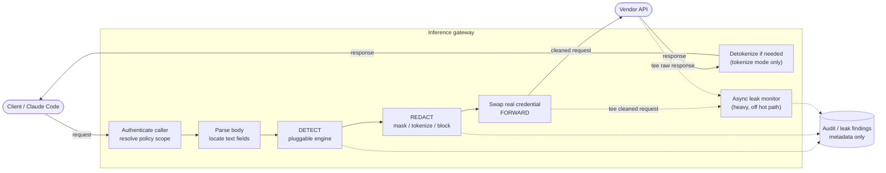
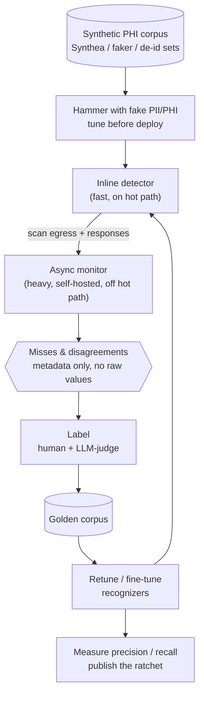

# A PII/PHI-Filtering Inference Gateway — Design & Feasibility

*A self-hosted reverse proxy that redacts sensitive data from LLM traffic before it leaves your network. Vendor-neutral; nothing here is tied to a particular product.*

---

## 1. ELI5

Every message your apps and developers send to an AI provider passes through a checkpoint **you** own. The checkpoint reads the message, spots anything sensitive — a Social Security number, a patient name, a credit card — and either masks it, swaps it for a placeholder, or stops it. Only the cleaned message goes on to the AI. When the AI replies, the checkpoint can swap the real values back in so the person still gets a useful answer. The provider never sees the raw secrets, and you keep a record of what was caught. **That checkpoint is the inference gateway.**

## 2. What it is (one level up)

An inference gateway is a **reverse proxy that speaks the same API dialect as the AI vendors** (OpenAI-compatible, Anthropic Messages, etc.). Clients point their SDK's base URL at the gateway instead of the vendor. The gateway authenticates the caller, runs a pipeline of policy checks (PII/PHI detection + redaction, optional budget/rate limits), forwards the cleaned request to the real vendor using a credential **only the gateway holds**, then returns the response (detokenizing if needed) while teeing a copy to an async monitor.

This is a well-trodden pattern — LiteLLM, Portkey, Cloudflare AI Gateway, and Kong AI Gateway are all variations. The only genuinely new design work is the redaction pipeline and where it sits.

## 3. Is it possible? Yes — and it's tractable

Three facts make it straightforward:

1. **Vendor inference APIs are plain HTTPS + JSON.** A reverse proxy can read, transform, and forward them with standard tooling.
2. **Sensitive content lives in predictable fields** — `messages[].content`, `input`, `prompt`. You don't parse the whole schema; you walk the known text-bearing fields.
3. **Detection is a solved, off-the-shelf problem** across a spectrum from regex to NER to managed DLP. You compose engines; you don't invent one.

The gateway is "just" an HTTP handler with an ordered middleware chain. Feasibility isn't in question — the engineering is in **correctness** (don't corrupt JSON, don't break streaming) and **recall** (catch enough of the PII).

## 4. Architecture



The response goes back to the caller on the fast path (detokenized first only if needed); **split copies of the post-redaction request *and* the response are teed to the async monitor** rather than gating anything — see §11.

| Component | Responsibility |
|---|---|
| **Protocol adapter** | One per API dialect (OpenAI-compatible, Anthropic Messages). Knows where the text lives and how streaming is framed. |
| **Credential broker** | Maps the caller's gateway key → the real upstream credential, held server-side, never exposed downstream. |
| **Policy engine** | Resolves which rules apply (per route / per caller / per data-classification baseline). |
| **Detector interface** | Pluggable. `Detect(text) → []Span{start, end, type, confidence}`. |
| **Redaction/transform** | Applies an action per span: mask, tokenize (reversible), hash, or block. |
| **Token vault** | *(reversible mode)* placeholder ↔ original map *and* the oracle's source of truth; short TTL, encrypted, KMS-backed, scoped per conversation/tenant. |
| **Forwarder** | Streaming-aware HTTP client to the vendor. |
| **Audit sink** | Structured record of *what type* was detected/redacted — never the value. |
| **Async leak monitor** | Heavy, self-hosted detector off the hot path; re-scans teed egress + responses to catch inline misses (§11). |
| **Capture buffer** | Short in-memory FIFO of recent payloads; lets a monitor finding rejoin its prompt for training, then ages out (§11). |

## 5. Request/response flow (where the hooks are)

**Outbound (request):**
1. Receive at `/v1/...` (or `/{vendor}/...`).
2. Authenticate the gateway key → resolve identity + policy scope.
3. Parse body; locate text-bearing fields via the protocol adapter.
4. Run the configured detector over each field → spans.
5. Apply the action (mask / tokenize / block). On `block`, return 4xx and **do not forward**.
6. Swap in the real upstream credential; forward to the vendor.

**Inbound (response):**
7. **Return to the caller directly** — detokenize on-path first if in `tokenize` mode, otherwise pass through untouched. The return is *not* gated on a response scan.
8. **Tee a copy to the async leak monitor** (off the hot path); it scans the raw response and emits findings (metadata only) into the flywheel.
9. Streaming (SSE): stream to the caller as bytes arrive; the monitor consumes the same bytes off-path. *(Detokenization in `tokenize` mode still happens on-path; see Caveats. Add a synchronous response guard only if you must stop model-generated PII from reaching the caller — see §11.)*

The detector runs twice — **synchronously on the request** (where it redacts) and **asynchronously on the response** (where it only monitors). Same interface, different urgency.

## 6. Pluggable detection backends (the "other tools")

The detector is an interface, so you mix engines by policy:

| Engine | What it is | Strengths | Trade-off |
|---|---|---|---|
| **In-process regex** | Built-in recognizers: email, phone, SSN, credit card (Luhn), IP, IBAN, MRN/account patterns | Zero dependencies, nothing leaves the process, microsecond latency, deterministic | Misses names/addresses & free-text PHI; needs tuning |
| **Microsoft Presidio** (self-hosted) | OSS analyzer/anonymizer: regex + spaCy NER + context boosting; medical recognizers | Strong recall incl. names; anonymization built in; **self-hosted → PHI stays in your infra** | Another service to run; higher latency |
| **AWS Comprehend / Comprehend Medical** | Managed PII / PHI detection (Comprehend Medical is HIPAA-eligible) | Best recall on clinical text; maintained | Sends content to a third party (**BAA required**); per-call cost/latency |
| **Google Cloud DLP / Azure AI Language PII** | Managed DLP with health domains + de-identify transforms | Broad infoType coverage; managed | Same third-party + BAA caveat |
| **LLM classifier** *(optional)* | A small model labels/judges spans | Catches context-dependent cases | Latency, cost, and you're sending data to a model — use only as augmentation |

**Recommended composition:** regex always-on as the fast deterministic floor; **escalate to Presidio or managed DLP per policy** (healthcare route → Presidio + Comprehend Medical; general route → regex only). Detectors run in an ordered chain; overlapping spans are merged.

## 7. Redaction actions

- **Mask** — typed placeholder (`[EMAIL]`, `[SSN]`). Irreversible; simplest. Model and caller both see placeholders.
- **Tokenize (reversible)** — replace each value with a token, keep a short-TTL vault map, **detokenize on the response** so the caller gets real values while the vendor never did. Bind the token to the value **deterministically but scoped + salted** (e.g. `HMAC(conversation_salt, value)`) so the same entity gets the *same* token every turn — otherwise the model sees one person as `<PERSON_1>` then `<PERSON_4>`, and you lose the cross-turn consistency the oracle (§11) depends on. Don't make tokens *globally* deterministic, though — that lets a vendor correlate the same entity across sessions. Most useful action; needs the vault + streaming care.
- **Hash / pseudonymize** — stable one-way token; good for analytics, not reversible.
- **Block** — refuse the request (fail-closed). Strongest, lowest utility; good for a hard "PHI never leaves" rule.

Action can be driven by a data-classification baseline: healthcare → tokenize-or-block, finance → mask, general → monitor-only.

## 8. Build & config plan (MVP first)

Keep it **off by default and isolated** — opt-in, with nothing else depending on it.

| Milestone | Scope | Est. |
|---|---|---|
| **M1 — Pass-through proxy** | One protocol adapter; authenticate gateway key, swap upstream credential, forward, return. No filtering. Prove round-trip + streaming. | 1–2 d |
| **M2 — Regex detector + mask** | `Detector` interface + in-process regex engine; request-side `mask`; audit logging (metadata only). A usable PII filter. | 1–2 d |
| **M3 — Reversible tokenize + response tee** | Token vault (scoped/salted bind), detokenize on response, async response tee (not a gate), SSE buffering. | 2–3 d |
| **M4 — External detectors** | Presidio adapter, then a managed-DLP adapter, behind the same interface; select by policy. | per backend |
| **M5 — Hardening** | Per-caller budget/rate hooks, `FAIL_MODE`, metrics, load test. | — |
| **M6 — Flywheel** | Async monitor, tokenization oracle, capture buffer + surrogate-on-promotion, golden-corpus retrain loop. | demand-driven |

**Config surfaces (env / file):**

```
GATEWAY_ENABLED          off | on            # default off
GATEWAY_LISTEN_ADDR      host:port
UPSTREAMS                route → { base_url, credential_ref }
DETECTOR                 regex | presidio | comprehend | dlp | azure   (or ordered list)
DETECTOR_ENDPOINT        url                 # external engines
DETECTOR_CREDENTIAL_REF  vault://...         # external engines
REDACT_ACTION            mask | tokenize | block | per_policy
TOKEN_DERIVATION         random | hmac-salted   # hmac → stable token within scope
TOKEN_SCOPE              conversation | tenant   # never global (cross-session correlation)
CAPTURE_BUFFER_TTL       seconds (>= monitor p99) # in-memory FIFO of recent payloads
CAPTURE_SURROGATE        on | off                 # synthetic-substitute before durable store
SCAN_RESPONSES           true | false
MONITOR_DETECTOR         heavy engine for async leak-scan (off hot path)
MONITOR_SAMPLE_RATE      0.0–1.0  (+ always-scan low-confidence)
FAIL_MODE                open | closed       # behavior when a detector errors
AUDIT_SINK               where redaction metadata goes
LEAK_EVENT_SINK          where leak findings go (metadata only — no values)
```

Secrets are stored **by reference** (vault/KMS), never inline.

## 9. Recommended stack

The data plane is latency-critical and streaming-heavy; the detectors are CPU/IO-bound and language-flexible. **Split them** — a fast proxy core, with detectors as in-process libraries or sidecar services behind one interface.

| Layer | Recommendation | Why |
|---|---|---|
| **Proxy / data plane** | **Go** — `net/http` + `httputil.ReverseProxy` (or a thin body-rewriting handler); `io.Pipe` + `http.Flusher` for SSE | Low GC latency, first-class streaming, single static binary, trivial in-process regex |
| **Built-in detector** | Go `regexp` (RE2 engine) | Linear-time matching, no catastrophic backtracking — safe on hostile input |
| **Heavy detector** | **Microsoft Presidio** as a sidecar (Python/FastAPI container) over HTTP; or managed DLP via REST/SDK | Keep NER/ML out of the hot binary; scale it independently; PHI stays in your infra |
| **Token vault** (reversible mode) | **Redis** with short TTL + envelope encryption via KMS / Vault Transit; in-memory map with TTL for single-node dev | Cross-pod, expiring, encrypted |
| **Secrets** | Cloud KMS / Secrets Manager / HashiCorp Vault; reference-only in config | No plaintext credentials at rest |
| **Observability** | **OpenTelemetry** traces + metrics (GenAI semantic conventions), structured JSON logs | Latency/recall visibility; redaction-safe logging |
| **Deploy** | Container; **stateless data plane** behind an L7 load balancer; horizontal scale | State lives in Redis/KMS, so scale-out is trivial |

**Alternatives:** Rust (axum/tower) for maximum throughput and an elegant middleware model; Node/TypeScript if your team is JS-first and scale is moderate. **Avoid Python on the hot proxy path** — it's the right language for the *detector sidecar*, the wrong one for the per-token streaming loop.

## 10. Testing strategy

Five fronts: detection accuracy, proxy correctness, resilience, performance, and safe rollout.

- **Detection accuracy (golden corpus).** A labeled fixture set with known spans; track **precision/recall per detector** over time so changes can't silently regress. Seed the hard cases: names/addresses (NER-only), MRNs and account numbers, internationalized formats, PII **split across stream chunks**, and false-positive traps (order numbers that look like SSNs, semver that looks like a date).
- **Proxy correctness (round-trip).** Forward through a **mock upstream** and assert: the raw PII never reaches the mock, the JSON shape comes back byte-faithful (no corruption), and the caller's gateway key was swapped for the real credential. Reversible mode: tokenize → forward → **detokenize** returns the original values; verify token *stability* (same value → same token in scope, distinct values → distinct tokens) and TTL expiry.
- **Streaming / SSE.** The signature test — an SSN straddling two chunks is still caught. Assert time-to-first-token stays within budget and the event framing isn't broken.
- **Resilience / fail modes.** Detector timeout or error honors `FAIL_MODE` (open vs closed); upstream 5xx/timeout handling; large-body and backpressure behavior.
- **Security / leakage.** Scan **audit + log output for raw PII** as a standing regression guard against "logging what you redact"; confirm the upstream credential never reaches the client; fuzz the JSON rewriter for corruption.
- **Performance.** p50/p95/p99 *added* latency under concurrency; throughput; memory under large payloads.
- **Safe rollout (shadow mode).** Run a new detector or policy in **detect-and-log-only** against real traffic to measure recall and false-positive rate *before* flipping enforcement on.
- **Flywheel invariants (safety-critical).** The oracle flags *every* previously-tokenized value that recurs in plaintext (deterministic, no misses); the capture buffer never persists raw PHI to durable storage; surrogate-on-promotion leaves *zero* real values in the corpus (scan it to prove it); buffer TTL ≥ monitor p99 so a finding still finds its prompt.

Wire the corpus, round-trip, and fail-mode suites as fast CI checks; run load and shadow tests continuously.

## 11. Self-improving detection (the flywheel)

Recall is never 100% (see *Caveats*), so treat detection as something you **ratchet**, not something you ship once. The design is **two detectors, not one**:

- **Inline detector** — fast, latency-bounded; does the actual redaction on the hot path.
- **Async monitor** — a heavier, **self-hosted** detector (full Presidio, a local NER model, or an LLM-judge) that runs **off the hot path** over egress payloads *and* responses. No latency budget, so it can be as thorough as you like — sample a fraction of traffic plus 100% of low-confidence cases to control cost.

The **gap between them is the training signal.** Anything the slow monitor catches that the fast inline detector missed is both (a) a leak event for alerting/metrics and (b) a labeled example for the corpus. Close the gap and recall climbs.

**Train on synthetic data.** Generate volume with [Synthea](https://synthetichealth.github.io/synthea/), faker, and public de-identification challenge sets (i2b2/n2c2); hammer the inline detector with fake PII/PHI and tune precision/recall **before deployment**. Live traffic is for *detecting* leaks in prod and surfacing hard cases — never for training directly.

**Tee the response, don't gate it.** Return the vendor's response to the caller directly and feed a *split copy* to the async monitor — don't block the return on a response scan. If PII slipped past the inline detector on egress, the vendor already saw it, so re-scrubbing the echo protects no one new, and the tee yields the same training signal without latency. Watching responses is still worth it: an outbound miss usually resurfaces as the model echoing the value back, and the monitor also catches PII the model *generated or retrieved* that was never in the request (RAG over-share, regurgitation, a fabricated SSN). Three things to keep deliberate:

- **Detokenization stays on-path.** In `tokenize` mode the response carries your placeholders (`<PERSON_1>`); restore real values *before* the caller sees them or the answer is unusable. Only the *leak scan* is async. (`mask`/`block` has nothing to restore — clean pass-through + tee.)
- **Response-originated PHI is a separate threat.** "Already leaked once" only covers PII that came from the request. If the model can generate or retrieve protected data that wasn't in the prompt, the tee catches it *after* the caller saw it — acceptable for egress-protection on dev traffic, not for an app surfacing output to end-users, where you'd add a synchronous guard for that class only.
- **"Caught next turn" is real — but via the vault, not the detector.** The inline detector that missed a value won't reliably re-catch it on the resend; what catches it is the *tokenization oracle* below, which already *knows* that value is sensitive.

**The tokenization oracle catches the long tail.** The vault is more than a detokenization map — it's a list of values you've *already proven* are sensitive. Scan every later request and response for any previously-tokenized value appearing in **plaintext**: a hit is a **deterministic leak, zero false positives** (you already established that value is PII) and the highest-signal training example available. This is where the long tail lives — context-sensitive detectors (NER, LLM-judge) are **turn-unstable**: a value caught on turn 1 is missed on turn 3 when the context shifts or the model reformats it (`John Smith` → `Mr. Smith`), and tokens drift (`<PERSON_1>` then `<PERSON_4>`) unless you bind them (§7). The oracle turns that instability into a label, and a cheap exact-match version can run **inline** as a deterministic safety net ("does this outbound payload contain a known-sensitive value the detector didn't flag?"). Kept honest:

- **The never-caught class is the monitor's job, not the oracle's.** The oracle only catches values it tokenized at least once; a true turn-1 miss isn't in the vault. The async monitor finds those — and the capture buffer below turns them into training examples before they evaporate.
- **Variants need normalization.** Exact recurrence is deterministic; `Mr. Smith` vs `John Smith` needs fuzzy matching, which reintroduces some false positives. Exact + light normalization is the zero-FP core; fuzzy is a softer outer ring.
- **The vault is now the most load-bearing store you have** — it holds proven-sensitive values *and* drives leak detection. Scope per conversation/tenant, short TTL, encrypted, in-boundary.

**Capture novel misses with a short rolling buffer.** To turn a turn-1 miss into a training example you need the prompt that produced it — but the async monitor runs *behind* the request. Bridge that with a small **in-memory FIFO buffer** of recent payloads keyed by `request_id`: when the monitor flags a value, marry it back to its originating prompt, promote the pair, and let everything the monitor *doesn't* flag age out of the ring and vanish. Two constraints keep it a working set, not a lake:

- **Size the window to the monitor's latency, not the clock.** Its *lower* bound is the monitor's worst-case decision time — too short and findings arrive after their prompt already evicted (you detect the leak but can't attribute it); its upper bound is your risk tolerance. Seconds, not minutes. In-memory, bounded, FIFO, in-boundary, encrypted, never to disk/log/swap.
- **Surrogate on promotion — keep the durable corpus synthetic.** What you learn is "a value of *this shape* in *this context* slipped through," which rarely needs the literal value. Substitute the captured PHI with a structurally-faithful **synthetic surrogate** before it reaches durable storage. The transient buffer is the only place real PHI lives; the corpus you keep stays synthetic — the principle you set from the start. (Where a human must see the real value to label it, that's the short-TTL, access-logged quarantine, purged after.)

**The retention trap — and the way through.** Logging *all* traffic for a *long* rolling window rebuilds the exact PHI lake the gateway exists to prevent. Keep raw text to the two narrow places that actually need it — the seconds-long capture buffer above, and nothing durable — and for everything else persist the *signal*, not the text:

- **Scan in-flight, persist findings, not bodies.** The text is already in memory as it passes — emit a leak event (`{request_id, type: SSN, confidence: 0.9, in_redaction_map: false}`), never the value. Optionally a salted hash or a `last-4` masked excerpt for triage.
- **Quarantine only the flagged misses** — de-identified where possible, encrypted, short TTL, inside the BAA/ZDR boundary, access-controlled — for the human/judge labeling step. Not all traffic.
- **Keep the monitor self-hosted** for PHI (or strictly BAA-covered) — sending text to a third party to check whether it contains PII is the same leak you're guarding against.

The payoff is the one number competitors don't publish: a **measured recall ratchet** — *"v3 catches 96.2% of held-out PHI spans, up from 91%, at the same false-positive rate"* — backed by a loop that keeps it climbing.



## 12. Routing Claude Code through the gateway

**Short version: yes.** Point Claude Code at the gateway with the officially supported variables:

- `ANTHROPIC_BASE_URL` → your gateway URL.
- `ANTHROPIC_AUTH_TOKEN` → a key your gateway issues (sent as `Authorization: Bearer`); the gateway holds the real Anthropic API key server-side.
- Set via `~/.claude/settings.json` `env` block or shell profile.

"A key your gateway issues" is literal since the keystore landed (2026-08-15): register an app, issue a key against it tagged with a subject, optionally scoped to one route and an expiry, and revoke it independently of every other caller — `./scripts/keystore.sh`. The value of that is less the authentication (a shared secret already did that) than the two things a shared secret cannot do: every request is **attributed** to an app on the traffic feed, and an app can be served its **own baseline**, so one gateway can run a monitor-only client and a masking client side by side. Revocation is eventual, bounded by the policy-pull interval. See `DECISIONS.md` 2026-08-15 "Gateway keystore".

Anthropic's docs describe routing Claude Code through **corporate proxies and custom LLM gateways** with exactly these variables — it's an intended deployment pattern. Authenticate the gateway to Anthropic with a **first-party API key** (Console, or Bedrock/Vertex under your commercial terms), not a consumer subscription login. Bonus: with a **BAA + Zero Data Retention** enabled on your org, the BAA extends to Claude Code's API traffic — a natural pairing with a PHI-redacting gateway.

## 13. Caveats & failure modes

- **You become latency-critical and a SPOF.** Every call traverses you. Budget for HA, timeouts, and a documented `FAIL_MODE` (fail-open keeps availability but can leak; fail-closed protects but can outage).
- **Streaming is the hard part.** SSE arrives token-by-token; a regex can't see an SSN split across chunks. Buffer to safe boundaries or scan a sliding window — at the cost of time-to-first-token.
- **Recall is never 100%.** Regex misses free-text; even NER/DLP has false negatives *and* false positives. This is risk **reduction**, not a guarantee. Tune, measure, layer engines.
- **The vault and capture buffer are sensitive stores.** Reversible tokenization makes the vault hold real PII (and drive the oracle); the capture buffer transiently holds raw payloads. Both need in-memory/short-TTL, encryption, and access control — and the durable corpus must stay synthetic (surrogate on promotion). Mask/block avoid the vault entirely.
- **Per-vendor request shapes drift.** New params, multimodal inputs (image/audio/file), and tool-call payloads carry PII in places your adapter may not walk. Keep adapters current.
- **Don't log what you redact.** Audit the *fact* and *type* of a detection, never the value — or you've recreated the leak in your logs.
- **Compliance ≠ the gateway.** HIPAA/PCI/GDPR need BAAs/DPAs, retention controls, and access governance *around* the gateway. It's one control, not the whole program.
- **Provider terms can change.** Keep the gateway's auth first-party and re-read the provider usage policy periodically; enforcement can arrive without prior notice.

## 14. Bottom line

Feasible, well-trodden, and buildable in a few focused milestones. The redaction pipeline is a single pluggable interface called on the way out and the way back. A fast proxy core plus detectors-behind-an-interface keeps it simple to start and easy to harden, and routing Claude Code through it is explicitly supported as long as the gateway uses first-party API-key auth for your own org.

## 15. Can we build it → should we build it? — a straight read

> *Claude Opus 4.8 (xhigh effort), re-assessed 2026-06-30 against the companion build plan and a live HIPAA requirement:*
>
> ***Can we build it?*** *Yes — and that isn't a courtesy. The author of this document already shipped the control plane this gateway bolts onto: sixteen vendor adapters, a policy-and-drift engine, a synthetic surface layer, a green test suite. The gateway is the smaller, more contained problem. Its core is a reverse proxy that rewrites JSON and swaps a credential; the genuinely hard parts are narrow and well-understood (streaming correctness, and detection recall via a regex floor plus a real NER/DLP engine). Neither is research. And the asks that shaped this document — keep it off the spine, tee don't gate, bind tokens so the oracle works, surrogate before the corpus — are the right questions in the right order. The capability is not in doubt — and a companion build plan has since sequenced it end to end (a separate, horizontally-scalable data-plane service, with the milestones and a minimal MVP slice spelled out), so "how, and how does it scale" is no longer open either.*
>
> ***Should we build it? — re-assessed.*** *The standalone read was "not by default — on demand," and for good reason: the gateway makes you latency-critical, a SPOF, and the owner of per-vendor request-shape upkeep and a live PHI path, while the spine delivers most governance off the request path. A real HIPAA requirement is exactly the demand that verdict was waiting for — and it tips the answer, on one condition. The deciding question isn't "do we touch PHI," it's: **is there a window where PHI-bearing traffic can reach a model before a BAA + Zero-Data-Retention covers it, and must that be prevented technically rather than policed by policy?** If yes — a pre-coverage gate, a dev/agent pilot running ahead of the contract, a "no PHI until ZDR is on" mandate — the spine genuinely cannot help: driving admin APIs and pushing managed config are both off the request path, and a BAA you haven't signed protects nothing. The exposure is an impermissible disclosure to an uncovered vendor, and the only control that stops it at call time is the gateway — a blocking gate is a **technical** safeguard where a policy is merely an **administrative** one. So build it; the build plan makes starting cheap: the pre-coverage gate is a four-milestone vertical slice (skeleton → pass-through → detect-and-block → policy + enforcement-reporting wiring), a single replica, fail-closed, with none of the reversible-tokenization, oracle, or horizontal-scale machinery needed until traffic volume or detokenized-response requirements actually arrive. If instead the posture is "wait for the BAA, then rely on it," the gateway stays optional: once BAA + ZDR is in force the contract covers the disclosure and the spine carries the rest, the gateway earning its keep only as defense-in-depth minimum-necessary scrubbing (and the same data plane is still where a hard cross-vendor spend stop would live). Either way, **compliance ≠ the gateway (§13)**: HIPAA still needs the BAAs, retention controls, and access governance *around* it — the gateway is one technical safeguard, not the program — and the differentiator, a published recall ratchet on top of dual control, remains worth more than anything the proxy-only incumbents ship. Net: with a real pre-coverage requirement on the table, this comes off the shelf **now** — built as the minimal block-gate slice first, hardened only as the requirement does.*

> *Claude Fable 5 (high effort), re-assessed 2026-07-02 against the shipped MVP — the two prior reads stand; this one is written after the fact:*
>
> ***Can we build it? — answered by shipping.*** *The question closed on 2026-07-02, the same day it stopped being hypothetical. What exists on `main` and runs as three containers: the separate data-plane binary this document argued for (`cmd/air-traffic-gateway`, dep-isolation ratchet test keeping the control plane stdlib-only), pass-through with gateway-key auth and credential swap, the regex floor plus a self-hosted Presidio tier chained with span merge and engine-independent type guards, mask/block enforcement, and the spine integration that makes `proxy_enforced` an honest claim — heartbeat-gated, staleness-drifted, never asserted without a live gateway behind it. The verification story landed with it, not after it: a harness that scores redaction **behaviorally** (a planted value reaching the mock upstream is a leak, whatever the detector reported), a 200-request seeded run reading 100% behavioral recall / 97.7% precision / zero trap FPs on pack v2, and the first real turns of the flywheel — misses promoted to a permanent replay corpus, config-knob proposals (curated regex, Presidio score-gates with probe evidence, deny-lists for free-text types) approved by a human and hot-reloaded into a versioned pack. The ratchet is no longer a design promise; it is a ledger with points on it. The estimate held: the core was a contained problem, and it behaved like one.*
>
> ***Should we have built it? — also re-assessed, honestly.*** *What shipped is the §15 verdict's shape almost exactly: the minimal slice, single replica, fail-mode configurable, none of the machinery the requirement didn't yet demand. The deliberate deferrals are load-bearing and should stay deferred on the same trigger discipline: reversible tokenization + vault (G3), response-side enforcement and the async monitor (G4), the oracle (G5), managed DLP adapters (rest of G6), the recall-ratchet publication pipeline and log-leak CI (G8), horizontal scale and hard spend stops (G9), and the learning loop beyond curated candidates (G10). Nothing built so far forces any of them early, and nothing deferred blocks the pre-coverage gate use case. Two cautions keep this read straight. First, what exists is proven against synthetic traffic only — the harness's ground truth is exact by construction, which is precisely why its numbers are trustworthy and precisely why they don't yet claim anything about live PHI at production volume; the number the gateway publishes is honest about being a harness number. Second, the standing costs §15 warned about were accepted, not refuted: a request-path service now exists, and someone owns its latency, its availability, and its request-shape upkeep from here on. Net: the build answered "can" definitively and vindicated "should" for the slice that was built — the gateway is real, honest about what it enforces, and cheap to have stopped here; the next dollar goes in only when a requirement (traffic volume, detokenized responses, a second vendor dialect, a live-PHI SLA) pulls it, exactly as the deferral list intends.*

---

### Sources
- Anthropic — *Claude Code: Legal and compliance* (authentication/credential use; BAA + ZDR): https://code.claude.com/docs/en/legal-and-compliance
- Anthropic — *Claude Code: Authentication* (`ANTHROPIC_BASE_URL`, `ANTHROPIC_AUTH_TOKEN`, gateways/proxies): https://code.claude.com/docs/en/authentication
- Microsoft Presidio: https://microsoft.github.io/presidio/
- AWS Comprehend Medical (PHI): https://aws.amazon.com/comprehend/medical/
- Google Cloud DLP / Sensitive Data Protection: https://cloud.google.com/security/products/dlp
