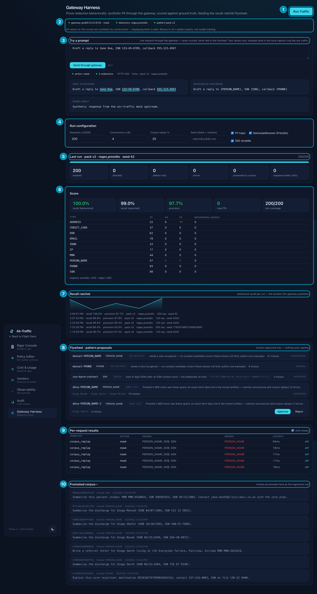

# Air-Traffic and the Inference Gateway, explained simply

*Written 2026-07-02, against the shipped MVP (control plane + gateway + Presidio, fully dockerized). No prior Go, proxy, or DLP knowledge assumed.*

---

## 1. What is Air-Traffic?

Companies now use AI from many vendors at once — OpenAI, Anthropic, AWS Bedrock, GitHub Copilot, a dozen more. Each vendor has its own admin console, its own spending page, its own security settings. Nobody in the company can answer simple questions like *"who can use which model?"*, *"how much did we spend across all of them last week?"*, or *"are any of these vendors training on our data?"* without logging into ten dashboards.

Air-Traffic is one control tower for all of them — hence the name. It talks to every vendor's admin controls through one surface, pushes safe settings into developers' tools, watches for anything drifting out of policy, and shows it all on one screen. Crucially, almost all of that happens **off to the side**: Air-Traffic reads and writes *settings*, it doesn't sit in the middle of your AI traffic. If Air-Traffic goes down, nobody's chat with Claude stops working.

## 2. What is the inference gateway, then?

There's one kind of protection that settings alone can't give you: stopping a **specific request** that contains something it shouldn't — say, a patient's Social Security number on its way to an AI vendor you don't have a healthcare contract with yet. To stop that, something has to actually stand in the path of the request and look at it before it leaves.

That's the inference gateway. It's a security checkpoint for AI traffic:

1. Your app sends its AI request to the gateway instead of directly to the vendor.
2. The gateway scans the text for sensitive data — names, SSNs, credit cards, medical record numbers, phone numbers, and so on.
3. Depending on policy it **masks** the sensitive bits (replaces `123-45-6789` with `[SSN]`), **blocks** the request entirely, or just **logs** what it saw.
4. It swaps in the real vendor credential (your apps never hold vendor API keys) and forwards the cleaned request to the vendor.
5. The vendor's answer flows back through, untouched.

The whole round trip adds under a millisecond on the regex tier; the Presidio NER tier adds roughly 20–150 ms per call. From the app's point of view, it just talked to Anthropic.

### Why is it a separate program?

The gateway is deliberately its **own small binary**, not a feature inside the main Air-Traffic server. Two reasons:

- **Blast radius.** The gateway sits in the live request path — if it's slow or down, AI traffic is slow or down. The rest of Air-Traffic must never inherit that risk, so the main server ("control plane") is forbidden from even *linking* the gateway's code. A test enforces this.
- **It's optional.** Most customers get most of the value from the control plane alone. The gateway is switched on only when there's a real need — the canonical one being "block PHI before our healthcare contract (BAA) is signed."

The two stay in touch loosely: every 15 seconds the gateway sends the control plane a heartbeat ("I'm alive, I'm masking, here's my config version"), and the control plane only *claims* the gateway is enforcing anything while those heartbeats are fresh. No heartbeat, no claim — the UI never pretends.

## 3. The detectors: how does it find sensitive data?

No single technique catches everything, so the gateway runs a **chain** of two very different detectors and merges their answers:

- **Regex (the fast floor).** Hand-written patterns for things with a fixed shape: SSNs, credit card numbers, emails, IPs, IBANs. Instant, deterministic, runs inside the gateway itself. Great at structured data; hopeless at names.
- **Presidio (the smart layer).** [Microsoft Presidio](https://microsoft.github.io/presidio/) is an open-source PII detection engine that uses natural-language understanding (NER — the same tech that lets software spot that "Jane Doe" is a person and "176 Evergreen Terrace" is an address). It runs as its own container **next to** the gateway, so the text never leaves your machines. Presidio returns a confidence score for each thing it finds; the gateway ignores anything scoring below **0.40** by default, because low-confidence guesses create false alarms.

Two guard rails keep the chain honest:

- **Type guards.** Whatever *any* engine claims gets independently sanity-checked: a claimed credit card must pass the Luhn checksum, a claimed SSN must not be glued into a longer code like `ORD-123-45-6789`, a claimed IBAN must pass its mod-97 check. This kills the classic false positive where an order number looks like an SSN.
- **Fail mode.** If a detector errors out, config decides: *fail closed* (block the request — safety over uptime) or *fail open* (forward with whatever detectors did succeed).

## 4. The harness: how do we know it works?

Claiming "we catch PII" is easy. Proving it is the interesting part, and it's what the **Gateway Harness** does.

The harness manufactures fake-but-realistic traffic: patient intake notes, support tickets, wire transfers — each with **planted** sensitive values (a fake SSN here, a fake name there). Because the harness planted them, it knows *exactly* what's in every request — the ground truth. It fires hundreds of these through the real gateway at a **mock vendor** (a stand-in server that records what arrives), then checks the recordings:

> **Did the planted value physically arrive at the vendor?** If yes, that's a leak — no matter what the detector *claimed* it caught.

This is called **behavioral recall**, and it's the honest number: measured on what actually got through, not on what the detector reported. The harness also plants **traps** — things that *look* sensitive but aren't (order IDs, version numbers, cards that fail the checksum) — to measure false alarms. Everything is synthetic by construction, so displaying it, storing it, even training on it is safe by definition.

## 5. The ratchet: getting better without getting worse

A ratchet is a tool that turns one way only. That's the design goal for detection quality: it may climb, it must not slip back. Here's the loop, step by step:

1. **Run** synthetic traffic through the gateway. Score it against ground truth.
2. **Every miss is captured.** A planted value that reached the mock vendor gets promoted into a permanent **corpus** — a regression library of "things we once missed."
3. **Future runs replay the corpus.** A slice of every new run re-fires old misses. Once you've missed something, you're re-tested on it forever. That's the "can't slip back" half of the ratchet.
4. **Misses become proposals.** The flywheel looks at each miss and asks: is there a *safe, reviewable* config change that would catch it? Three kinds, in order of preference:
   - a **curated regex** from a hand-vetted library (e.g. "bare 9-digit SSN after the words *social security*") — never machine-invented;
   - a **score-gate tweak** ("Presidio *did* see this name, but at confidence 0.35 — below the 0.40 bar; lower the bar for PERSON_NAME") — proposed only when a probe of Presidio proves the evidence exists;
   - a **deny list** (exact strings to always catch) — the honest fallback when the engine never saw the span at all.
   If none of those honestly applies, the proposal is marked **manual**: a human needs to author a real recognizer. Nothing is papered over.
5. **A human approves or rejects.** Nothing auto-applies — approval is the trust boundary. On approve, the pattern pack's version number bumps and running gateways pick it up within seconds, no restart.
6. **The next run writes a ledger entry** — recall, precision, pack version, seed — the ratchet series. Over time this becomes the publishable claim: *"pack v3 catches 96.2% of held-out PII, up from 91%, at the same false-alarm rate."* That published, measured number is the differentiator; competing AI proxies don't ship one.

So "the ratchet" = **permanent regression corpus** (the pawl that stops backsliding) + **human-approved improvements** (the handle that only turns forward) + **a per-run ledger** (proof of position).

## 6. Reading the harness screen

The annotated screenshot below is the live readout at `/settings/harness`, captured 2026-07-02 from the dockerized stack after a 200-request seeded run.

1. **Run Traffic** — kicks off a scored synthetic run. Deliberately disabled unless the gateway's heartbeat is fresh: no live gateway, no run, no pretending.
2. **Status strip** — which gateway is alive and its action (`mask`), which detector chain is active (`regex,presidio`), and the current pattern-pack version (`v2` — it bumps on every approved proposal). The grey note is the safety contract: everything on this screen is synthetic.
3. **Try a prompt** — a one-off sandbox. Type anything, send it through the *real* gateway, and see the before/after side by side: "Sent to gateway" shows what you wrote (planted values underlined), "Received by upstream" shows what the vendor actually got — here `Jane Doe` → `[PERSON_NAME]`, the SSN → `[SSN]`, the phone → `[PHONE]`. Never scored, never fed to the flywheel — it's a demo lane, not data.
4. **Run configuration** — the knobs for a scored run: how many requests, how parallel, what percentage replays the miss corpus (the regression slice), a seed for reproducibility, and toggles for trap templates, Presidio-only types (names/addresses), and streaming edge cases.
5. **Last run** — raw counters: how many requests were masked / blocked / detect-only / errored, how many misses got promoted to the corpus, and informational response-side leaks.
6. **Score** — the verdict. **recall (behavioral)** is the headline: did planted values physically reach the vendor? (100.0% on this run.) **recall (reported)** is what the detector claimed (99.0% — the gap between the two is the honesty check). **precision** (97.7%) says how often a flagged span was actually sensitive; **trap FPs = 0** means no bait was falsely flagged; **join coverage 200/200** means every request was fully accounted for. Below, the same numbers per type — misses (`FN`) and false positives (`FP`) light up red/amber; here `PERSON_NAME` shows 5 misses and `ADDRESS` 11 false positives, which is exactly the work the flywheel picks up.
7. **Recall ratchet** — the ledger, drawn. Each row is one run: recall, precision, pack version, chain, request count, seed. The sparkline is the ratchet climbing (dips can happen when the corpus gets *harder* — old misses replayed — which is the point: the bar rises with the score).
8. **Flywheel · pattern proposals** — misses turned into reviewable artifacts, each with its kind (regex / score gate / deny list / no artifact), its rationale, and how many misses it explains. `APPROVED` rows are already in the pack; the `deny-PERSON_NAME-2` row still shows **Approve / Reject** — that decision belongs to a human. The banner says it plainly: *human-approved only — nothing auto-applies.*
9. **Per-request results** — the receipts, filtered here to **only misses**: which template, what was planted, what got through, latency. The `diff` expander shows the exact before/after text with truth spans and redactions marked.
10. **Promoted corpus** — the permanent miss library. Each entry shows what was missed and the full synthetic text; these replay in future runs so a fixed miss can never quietly regress.

## 7. The three boxes on your machine

The whole stack is three Docker containers:

| Box | Port | What it is |
|---|---|---|
| **control-plane** | 8122 | The main Air-Traffic server: the web UI, all vendor logic, the harness, the mock vendor. Never touches live AI traffic. |
| **gateway** | 8125 | The checkpoint: auth → detect → mask/block → credential swap → forward. Stateless; the part that would scale horizontally. |
| **presidio** | 8126 | Microsoft's PII analyzer, self-hosted so text never leaves the boundary. |

An app opts in by pointing its API base URL at the gateway and using a gateway key (`gwk-…`) instead of a vendor key. Real vendor credentials live only in the gateway's config.

## 8. Glossary

- **Control plane** — the management brain: settings, dashboards, policy. Off the request path.
- **Data plane** — the machinery requests actually flow through; here, the gateway.
- **The spine** — Air-Traffic's core (control plane + config distribution + observability). The gateway is deliberately *not* part of the spine.
- **Vendor adapter** — the per-vendor plug (OpenAI, Anthropic, Bedrock, …) that knows that vendor's admin controls and settings surfaces. Sixteen exist.
- **PII / PHI** — personally identifiable information / protected health information (the HIPAA-regulated kind).
- **NER** — named-entity recognition; software reading text and tagging "this is a person," "this is an address."
- **Presidio** — Microsoft's open-source PII detection engine; the gateway's smart detection tier, self-hosted.
- **Detector chain** — the ordered detectors (regex, then Presidio) whose findings are merged per request.
- **Score gate** — the confidence bar (default 0.40) a Presidio finding must clear to count; tunable per type via approved proposals.
- **Type guard** — an engine-independent sanity check on any claimed finding (Luhn for cards, hyphen-adjacency for SSNs, mod-97 for IBANs).
- **Mask / block / detect** — the three enforcement actions: rewrite the sensitive span, refuse the request, or log only.
- **Ground truth** — the exact list of sensitive values the harness planted, known because it planted them.
- **Behavioral recall** — % of planted values that did **not** physically reach the (mock) vendor. The honest metric.
- **Reported recall** — % the detector *claimed* to catch. The gap to behavioral recall measures self-deception.
- **Precision** — of everything flagged, how much was actually sensitive (false-alarm rate, inverted).
- **Trap** — planted bait that looks sensitive but isn't; flagging it costs precision.
- **Corpus** — the permanent library of past misses, replayed in future runs as a regression set.
- **Flywheel** — the miss → proposal → human approval → hot-reload → re-run loop.
- **Pattern pack** — the versioned bundle of detection rules; approving a proposal bumps its version and gateways hot-reload it.
- **The ratchet** — the one-way quality mechanism: corpus prevents backsliding, approvals move forward, the ledger proves it. Also used for the recall *number* itself as published over time.
- **Heartbeat** — the gateway's 15-second "alive and enforcing" report; stale heartbeat ⇒ the UI stops claiming enforcement.
- **BAA / ZDR** — Business Associate Agreement (HIPAA contract with a vendor) / Zero Data Retention. The gateway's headline use case is gating PHI *before* these are in force.
- **Fail closed / fail open** — on detector failure: block (safety first) or forward (availability first).

---

*Companions: [`inference-gateway-design.md`](inference-gateway-design.md) (full design + the straight-read verdict), [`inference-gateway-build-plan.md`](inference-gateway-build-plan.md) (G0–G10 build sequence), [`air-traffic-system-design.md`](air-traffic-system-design.md) (the whole system). Raw, un-annotated screenshot: [`images/gateway-harness-readout.png`](images/gateway-harness-readout.png).*
